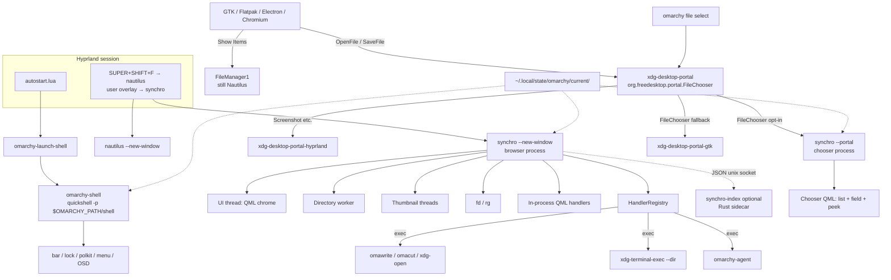
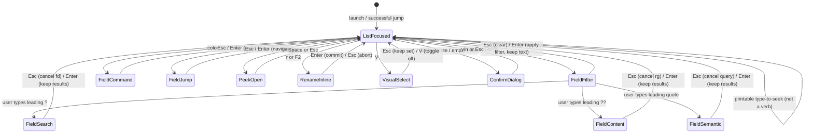
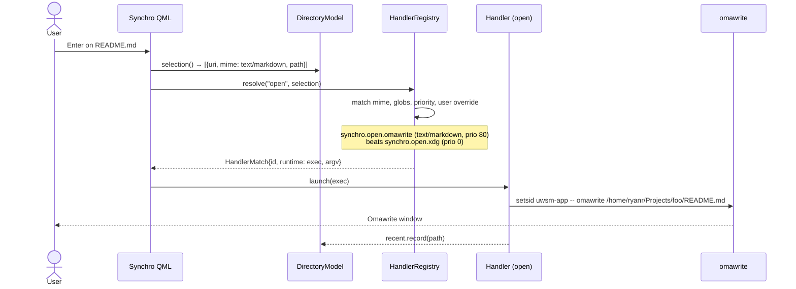
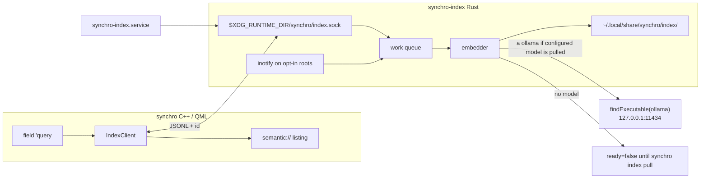

# Synchro — a native Omarchy file OS

| Field | Value |
|---|---|
| **Title** | Synchro: a QML file browser and handler OS for Omarchy |
| **Author** | Synchro design (Omarchy Quattro) |
| **Date** | 2026-08-15 |
| **Status** | Draft |
| **Audience** | Senior engineers implementing Synchro in `/home/ryanr/repos2026/synchro` |
| **Environment** | Omarchy 4.0 Quattro (`/etc/os-release` `VERSION_ID=4.0.0`; `/usr/share/omarchy/version` is `4.0.0.alpha`), Hyprland, Quickshell `omarchy-shell`, Qt 6.11.1 |

---

## Overview

Omarchy 4.0 ships Nautilus 50 as the default file manager. It is wired shallowly — `SUPER + SHIFT + F` launches `omarchy-launch-nautilus`, MIME `inode/directory` resolves to `org.gnome.Nautilus.desktop`, and `org.freedesktop.FileManager1` is owned by `nautilus --gapplication-service`. The rest of the desktop is not GNOME: chrome is a single long-running Quickshell process (`omarchy-shell`), theme tokens live in `~/.local/state/omarchy/current/theme/{colors.toml,shell.toml}`, and the apps that feel native (Omawrite, Omacalc, Omacut) are standalone Qt Quick processes that follow those tokens.

**Synchro is the Omarchy file OS:** a C++ / Qt Quick browser, the **OS-wide file picker**, a handler/plugin contract, and (after the picker) an optional local semantic index. The core owns listing, navigation, selection, search, thumbnails, trash, and the handler registry. Almost everything that *interprets* a file or folder is a handler: in-process QML for peek/folder surfaces, or an `exec` of a peer Qt/Quickshell app (`omawrite %f`, `omacut %f`, `omarchy-agent`). Third-party handlers install the same way Omarchy plugins do — a git repo with a `manifest.json` — but they load in Synchro's process (or as detached peers), never inside `omarchy-shell`.

The GNOME leftover that every app hits is **not Nautilus**. It is `xdg-desktop-portal-gtk`'s FileChooser. Synchro implements `org.freedesktop.impl.portal.FileChooser` as a chooser-mode window (same listing, command field, peek, theme, keyboard) so `omarchy file select`, Chromium, Flatpak, and GTK "Open/Save" become native. The browser window still ships side-by-side with Nautilus in v1. A skippable Rust sidecar (`synchro-index`) later embeds opted-in text locally; the GUI never depends on it.

---

## Background & Motivation

### What this machine actually is

This box is Omarchy 4.0 Quattro (`VERSION_ID=4.0.0`; the checkout stamp `/usr/share/omarchy/version` is `4.0.0.alpha`). The desktop chrome is one Quickshell process:

```
/usr/share/omarchy/default/hypr/autostart.lua
  → omarchy-launch-shell
    → QS_DISABLE_FILE_WATCHER=1 systemd-cat -t omarchy-shell --
       quickshell -n -p $OMARCHY_PATH/shell
```

Host entry is `/usr/share/omarchy/shell/shell.qml` (`ShellRoot`). Plugins are discovered by `/usr/share/omarchy/shell/services/PluginRegistry.qml`. Theme singletons are `/usr/share/omarchy/shell/Commons/Color.qml` and `Style.qml`. The UI kit is `/usr/share/omarchy/shell/Ui/` (`Panel`, `KeyboardPanel`, `TextField`, `ConfirmDialog`, …). Active theme files are `~/.local/state/omarchy/current/theme/{colors.toml,shell.toml}`; user typography overrides live in `~/.config/omarchy/shell.toml`.

The plugin culture is the prior art Synchro should copy, not the process Synchro should join:

- Manifest + `kinds` + `entryPoints` (`/usr/share/omarchy/shell/README.md`)
- Git install into `~/.config/omarchy/plugins/<id>/` via `omarchy plugin add <git-url>`
- `isSafeEntryPoint`: relative path, no `/` prefix, no `..` (`PluginRegistry.qml` lines 36–41)
- Reserved `omarchy.*` namespace (`omarchy-plugin-validate` rejects it for third parties)
- Unsandboxed-code warning before clone (`omarchy-plugin-add`)
- First-party plugins ship in-tree and load by default

### What Nautilus currently owns

| Surface | Current wiring |
|---|---|
| MIME default for folders | `xdg-mime query default inode/directory` → `org.gnome.Nautilus.desktop` |
| Keybind | `/usr/share/omarchy/default/hypr/bindings/applications.lua`: `SUPER + SHIFT + F` → `{ omarchy = "nautilus" }`, `SUPER + ALT + SHIFT + F` → `{ omarchy = "nautilus-cwd" }` |
| Bind expansion | `/usr/share/omarchy/default/hypr/helpers.lua` `command_from`: `{ omarchy = "X" }` → `omarchy-launch-X` |
| Launchers | `/usr/share/omarchy/bin/omarchy-launch-nautilus` → `setsid uwsm-app -- nautilus --new-window`; cwd variant adds `"$(omarchy-cmd-terminal-cwd)"` |
| Desktop file | `Exec=nautilus --new-window %U`, `DBusActivatable=true`, `MimeType=inode/directory;application/x-7z-compressed;…` |
| FileManager1 | `/usr/share/dbus-1/services/org.freedesktop.FileManager1.service` → `Exec=/usr/bin/nautilus --gapplication-service` |
| Extensions | `/usr/lib/nautilus/extensions-4/{libnautilus-python.so,libnautilus-image-properties.so,libtotem-properties-page.so}` |
| Window rules | `/usr/share/omarchy/default/hypr/apps/system.lua` floats Nautilus file-chooser titles and `org.gnome.NautilusPreviewer` |

Nautilus is **not** the file picker. Every "Open File" / "Save As" / directory dialog on this session — GTK, Flatpak, Electron, Chromium, plus `omarchy file select` (Share, Tailscale, LocalSend) — goes through xdg-desktop-portal:

| Piece | On this box |
|---|---|
| Client | `/usr/share/omarchy/bin/omarchy-file-select` (and every portal-aware app) calls `org.freedesktop.portal.Desktop` → `org.freedesktop.portal.FileChooser.OpenFile` |
| Frontend | `xdg-desktop-portal` 1.22.1 (`org.freedesktop.portal.Desktop.service`) |
| Session preference | `/usr/share/xdg-desktop-portal/hyprland-portals.conf`: `[preferred] default=hyprland;gtk` |
| Hyprland impl | `/usr/share/xdg-desktop-portal/portals/hyprland.portal` → `org.freedesktop.impl.portal.desktop.hyprland`. Interfaces: Screenshot, ScreenCast, GlobalShortcuts, InputCapture. **No FileChooser.** |
| GTK impl (the Adwaita dialog) | `/usr/share/xdg-desktop-portal/portals/gtk.portal` → `org.freedesktop.impl.portal.desktop.gtk`. `Interfaces=…FileChooser;…`. Service: `/usr/lib/xdg-desktop-portal-gtk` (`xdg-desktop-portal-gtk` 1.15.3). Floated by `o.window("xdg-desktop-portal-gtk", { tag = "+floating-window" })` in `/usr/share/omarchy/default/hypr/apps/system.lua`. |

Because Hyprland does not implement FileChooser, `default=hyprland;gtk` **falls through to gtk** for every pick. That is why the whole OS still feels like leftover GNOME after the chrome is Quickshell. Fuzzy pick from a path list (`omarchy-menu-file`) is a separate find+menu path and is not this dialog.

**Synchro owns FileChooser.** Replacing the impl upgrades `omarchy file select` automatically — that CLI is not forked.

### Pain points

1. **Wrong aesthetic and toolkit — twice.** Nautilus is libadwaita. The *other* GNOME surface, hit far more often, is the GTK portal FileChooser. Omarchy chrome is Quickshell + `Color`/`Style` tokens + monospace. Replacing only the browser leaves every Open/Save dialog Adwaita.
2. **Wrong extension model.** Python Nautilus extensions and `~/.local/share/nautilus/scripts` cannot be the way Omawrite, Omacut, or a future Quickshell photo surface attach to files. Those apps are already Qt Quick peers.
3. **Wrong process neighborhood.** Putting a file manager *inside* `omarchy-shell` would couple thumbnail workers, inotify, and preview QML to the bar, lock screen, notifications, and polkit. `omarchy-launch-shell` already supervises shell death and gives up after 5 relaunches in 60s. A file-manager crash must not take the session chrome with it.
4. **Missing Omarchy-native verbs.** Snapper is on PATH and `omarchy-snapshot` already wraps it. `SUPER + SHIFT + CTRL + A` launches `omarchy-agent --pick`. Screenshots land in `$OMARCHY_SCREENSHOT_DIR` / `XDG_PICTURES_DIR`. None of these are first-class in Nautilus.

### Prior art that *is* native

Standalone Qt Quick apps, not shell plugins:

| App | Version on this box | Contract |
|---|---|---|
| [omawrite](https://github.com/omacom-io/omawrite) | 0.5.0 | `omawrite.desktop`: `Exec=omawrite %f`, MIME `text/markdown;text/x-markdown;text/plain`, `StartupWMClass=omawrite`. ELF links `libQt6Quick.so.6`, no Quickshell. Upstream README (not verified from this package) says qmake6 and “follows desktop text size.” |
| [omacut](https://github.com/omacom-io/omacut) | 0.4.0 | `omacut.desktop`: `Exec=omacut %f`, video MIME, `StartupWMClass=omacut`. ELF links `libQt6Quick.so.6`, no Quickshell. Upstream README (not verified from this package) says qmake6 + ffmpeg and “follows your theme's accent color.” |
| omacalc | 0.2.2 | `omacalc.desktop`; floated in `system.lua` |

These are the template for "a QML app that feels Omarchy-native" — windowed, themed, `.desktop`-launched, crash-isolated. Synchro is that, plus a handler OS those apps can register with. The qmake-vs-CMake and live theme-follow claims for Omawrite/Omacut are upstream README text, not facts we re-verified from the installed binaries.

---

## Goals & Non-Goals

### Goals

- Replace the *feeling* of Nautilus on Omarchy: browse local POSIX files at interactive speed, keyboard-first, themed from Omarchy tokens.
- **Own the OS file picker.** Implement `org.freedesktop.impl.portal.FileChooser` as a Synchro chooser-mode window so `omarchy file select` and every portal-aware Open/Save become native. Opt-in first; default-on after the chooser is trusted. Do not fork `omarchy-file-select`.
- Ship a real handler contract in the first useful version: manifest, registry, install CLI, one first-party in-process preview (images), one exec-style `open` path.
- Own the core: listing, navigation, selection, name search, thumbnails, copy/move/rename/trash, undo of those ops.
- Feel like an Omarchy surface: always-visible command field (Ranger verbs on the list; `/` `:` `Ctrl+K` enter the field), peek on Space, no headerbar / hamburger / Places-sidebar-as-brand, monospace, `Color`/`Style` vocabulary.
- Stay crash-isolated from `omarchy-shell`. Chooser dialogs are a separate `--portal` process from browser windows.
- Slot a **skippable** local semantic index (`synchro-index`) after the picker. Not a first-paint blocker.
- Leave a slotting table so remaining Nautilus features can land later through handlers or core.
- Integrate *around* Omarchy (desktop file, user portal conf, user keybind overlay, optional later packaging) without editing `/usr/share/omarchy/` from this repo.

### Non-Goals (v1 / v1.x)

- Living inside `omarchy-shell` as a plugin.
- Claiming `inode/directory` or `SUPER + SHIFT + F` by default (browser stays side-by-side with Nautilus).
- Implementing `org.freedesktop.FileManager1` (still Nautilus). **FileChooser is in scope** as the first post-core PR, opt-in — not "later after we love the window."
- GVFS / SMB / SFTP / MTP / "Connect to server" / cloud providers.
- Tracker / localsearch / any always-on *desktop* indexer. The semantic sidecar is opt-in, idle-only, and skippable.
- Embedding all of `$HOME`, binaries, or leaving the machine.
- LLM chat over the corpus.
- Desktop icons (never).
- Tabs, split view, bulk rename, compress/extract, templates, user-script folder.
- Replicating libadwaita widgets or Nautilus's properties notebook.
- Rewriting the Qt/QML host in Rust.
- Sandboxing third-party handlers (they are unsandboxed user code, same as Omarchy plugins).
- Network-transparent file ops, admin/`pkexec` file ops, or multi-user file locking.

---

## Key Decisions

| # | Decision | Rationale |
|---|---|---|
| K1 | **Host runtime C — hybrid.** Qt 6.11 C++ core + QML UI in a standalone process. Handler loader supports (1) in-process QML via `import Synchro.Handler` and (2) detached `exec` of Qt/Quickshell peers with a stable argv/env contract. | File managers need `QAbstractListModel`, worker threads, inotify, trash, and later D-Bus. Omawrite/Omacut already prove this stack on Omarchy. Quickshell is a shell toolkit (`qs.Ui` is bar/panel-centric; `qs.Commons` assumes the shell host). Putting Synchro *in* `omarchy-shell` is rejected on crash isolation. A standalone Quickshell process would isolate crashes but fights the toolkit for windowed document UX and cannot give handlers a real C++ model. Hybrid keeps QML as the contribution language without pretending Synchro is a bar plugin. |
| K2 | **Synchro is never a child of `omarchy-shell`.** Own process. v1 thumbnails are in-process worker threads, not a second binary. | Thumbnail decode, directory watches, and preview QML must not share fate with lock/polkit/bar. `omarchy-launch-shell` already treats shell death as a session emergency. |
| K3 | **Core vs handlers is the product.** Core = list, nav, select, search, thumbs, file ops, registry. Interpretation = handlers (`preview`, `open`, `folder`, `action`, `location`). | This is the user's big idea and the thing that makes Synchro a file OS rather than "Nautilus with CSS." It also gives Omawrite/Omacut/future Quickshell apps a first-class attach point. |
| K4 | **Handler distribution copies the Omarchy plugin ritual**, but is Synchro's CLI: `synchro handler add <git-url>`. Third-party tree is `~/.config/synchro/handlers/<id>/`. Reserved namespaces `synchro.*` and `omarchy.*`. | Users already know `omarchy plugin add`. Reusing `omarchy plugin` itself would overload a shell-specific registry (`PluginRegistry.qml` kinds are `bar-widget`/`panel`/`overlay`/…). A sibling command with the same threat model and validate rules is the honest copy. |
| K5 | **Theme is a portable singleton that watches the *theme-set directory swap*, not a stable inode.** Do not import `qs.Commons`. | Shell `Color.qml` sets `watchChanges: false` on `colors.toml`/`shell.toml` and reloads via `omarchy-shell shell applyTheme` with base64 payloads. Synchro is a different process, so it must watch itself. `omarchy-theme-set` does `rm -rf ~/.local/state/omarchy/current/theme` then `mv` a new tree in (lines 163–165) and writes `~/.local/state/omarchy/current/theme.name`. A `QFileSystemWatcher` on `colors.toml` dies with the old inode. Watch `~/.local/state/omarchy/current/` (and `theme.name`); re-open the two toml files after debounce when both exist. Also watch `~/.config/omarchy/shell.toml` (the shell already does; `watchChanges: true`). Copy the parser vocabulary, not the QML module. |
| K6 | **Browser ships side-by-side with Nautilus.** Do not steal `inode/directory` or Super+Shift+F until **FileChooser is the default OS picker**. Two flips: (1) opt-in then default portal, (2) then folder MIME + Super+Shift+F. | Decided 2026-08-15. Two chances to rollback. |
| K7 | **Ranger-with-a-visible-field.** The command field is always-visible first-class chrome. The **list is focused** on launch and after every successful jump. Verbs (`j`/`k`/`h`/`l`/`n`/`r`/`y`/`d`/`p`/`u`/`t`/`v`/`.`) bind only in `list-focused`. `/` and `Ctrl+K` focus the field as filter; `:` focuses it as command palette. Printable keys type-to-seek on the list. Peek on Space. History, no tabs. | Omni-bar-always-focused makes `j`/`k`/`.` untypable as filter text. A hidden Ctrl+F is the GNOME thing we are not doing. Always-visible + list-focused is how SUPER+SPACE works: the menu is first-class, not always focused. See the state machine under Navigation. Closes former OQ7. |
| K8 | **Local POSIX + XDG trash only.** No GVFS in v1. | Speed budget and crash surface. Network locations become a later `location` handler family, not a core protocol stack. |
| K9 | **Exact search is `fd` then `rg`, not Tracker.** Semantic search is a later skippable sidecar (K20/K21). Field sigils: `?` = `fd -F` names, `??` = `rg` content, `'` = semantic. | Avoids a desktop indexer daemon. `~` is reserved for path jump (`~/…`); do not reuse it for semantic. |
| K10 | **Thumbnails: read the XDG cache if valid; write only `~/.cache/synchro/thumbs`.** Worker thread(s) inside the one v1 binary; never decode on the UI thread. | Reuse `/usr/share/thumbnailers` (ffmpegthumbnailer, glycin, evince). A raw PNG dropped into `~/.cache/thumbnails/large/` is not XDG-spec (missing `Thumb::URI` / `Thumb::MTime` tEXt + write-then-rename) and will be ignored or will poison Nautilus/imv. v1 reads a valid XDG hit; writing the shared cache is a later PR. |
| K11 | **C++/QML host. Optional Rust sidecar for the semantic index only.** rustc 1.97.1 / cargo 1.97.1 are on this box. Do **not** rewrite windows, models, theme, or FileChooser D-Bus in Rust. | Qt D-Bus is the path of least resistance for `org.freedesktop.impl.portal.FileChooser`. Embeddings / ANN / incremental corpus work are where Rust wins. IPC is JSON over a unix socket (or CXX later). **Synchro runs fully if `synchro-index` is absent** — `fd`/`rg` still work. |
| K12 | **Build with CMake + Qt6** for the host (one binary: GUI + `synchro handler` CLI + `--portal`). Cargo workspace member `synchro-index` is a **later** second target. | CMake for tests, `qt_add_qml_module`, install layout, and the portal service file. No thumbnail-worker executable. The Rust crate is skippable at package time. |
| K13 | **First-party previews never execute file content.** Images raster via Qt image providers / thumbnailers. Scripts, `.desktop`, and HTML are text/metadata. This is a **first-party policy**, not a loader invariant. | Third-party in-process QML is unsandboxed user code (same as Omarchy plugins) and can `import Process` / call `Qt.openUrlExternally`. v1 does not implement an import denylist. First-party `synchro.preview.image` is `Image {}` only. |
| K14 | **Phased surfaces.** FileChooser is K19. Thin **agent** `action` is in the first useful stack (PR 16). **Snapper is documented, not built**, in that stack. Capture inbox / workspace recents stay later. Semantic index is K20/K21, after the picker. | Decided 2026-08-15. |
| K15 | **This repo does not edit `/usr/share/omarchy/`.** Integration is a `.desktop` file, optional user keybind overlay, and later packaging that *can* add `omarchy-launch-synchro`. | Hard constraint from the brief. Upstream Omarchy changes are a separate contribution. |
| K16 | **App-id is `org.omarchy.synchro`.** Desktop file `org.omarchy.synchro.desktop`, `StartupWMClass=org.omarchy.synchro`, `QGuiApplication::setDesktopFileName("org.omarchy.synchro")`. v1 `--new-window` starts a **new process**. | Matches `org.omarchy.agent` / `org.omarchy.terminal` so Hyprland rules hit. Bare `synchro` (Omawrite's `StartupWMClass`) would miss `o.window("org.omarchy.synchro")`. No single-instance daemon in v1: each invocation is a process with its own `DirectoryModel`, undo stack, and registry. `--new-window` is accepted for Nautilus-launcher compatibility and is the default. Closes former OQ5. |
| K17 | **v1 is multi-select.** `SelectionModel` = cursor + selected set. Space stays peek. | Copy/trash/`%F`/`SYNCHRO_SELECTION.items[]` are multi-item. Status may show `3 selected`. See Navigation. |
| K18 | **Location kinds split into path / core-adapter / QML chrome.** `folder.replaceListing` is **not v1**. | QML cannot ship a `QAbstractListModel`. Home is a path jump; trash/recent/search are core adapters Synchro owns; optional `entryPoints.location` only wraps chrome. |
| K19 | **Synchro implements `org.freedesktop.impl.portal.FileChooser` as an early product surface.** Chooser mode of the same app (listing + field + peek + theme + keyboard). Opt-in via user `hyprland-portals.conf` first; do not fork `omarchy-file-select`. | The Adwaita dialog is the OS-wide GNOME leftover. Qt D-Bus adaptors; separate `--portal` process. Lands as soon as listing + field + theme + open/peek work — before FileManager1, Snapper, or a complete handler garden. |
| K20 | **`synchro-index` is a skippable Rust sidecar** under `synchro-index.service`. Socket `$XDG_RUNTIME_DIR/synchro/index.sock` (0600). JSONL with `id`. Absent ⇒ no semantic mode. `--portal` never starts it. | rustc 1.97.1 is here; keep ANN out of the GUI and the picker so a model crash cannot take either. |
| K21 | **Semantic search is offline embeddings + kNN, not an LLM and not cloud.** Store is **sqlite-vec**. Dim **768** (`nomic-embed-text`). Field `'`. **Do not vendor GGUF weights.** Embedder is ollama after an explicit `synchro index pull`. | Decided 2026-08-15. `auto` only if `ollama list` contains the configured local model. No package-size weights. |

---

## Proposed Design

### Process topology

Synchro is a session app, not shell chrome. Hyprland starts the shell via autostart; the user (or a later keybind) starts Synchro the way they start Omawrite.



**Hard isolation line:** a Synchro *browser* crash leaves the bar, lock, and the `--portal` process up. A chooser crash leaves browser windows and the shell up. `synchro-index` crashing only disables `'`. An in-process preview crash can take *that* Synchro process down — accepted, third-party preview lands disabled.

### Host runtime (decision C, defended)

#### What C++ owns

| Component | Responsibility |
|---|---|
| `DirectoryModel` | `QAbstractListModel` of the current listing. Roles: `name`, `path`, `uri`, `isDir`, `size`, `mtime`, `mime`, `iconName`, `thumbnail`, `isHidden`, `isSymlink`, `dirKind` (`posix`/`pending`/`trash`/`recent`/`search`). Names+generic icons first; `DT_LNK`/`DT_UNKNOWN` get a priority `fstatat` before the bulk second pass. |
| `DirectoryWatcher` | One **inotify** watch on the displayed directory (and `~/.local/share/Trash/files` when trash is open). Mask: `IN_CREATE\|IN_DELETE\|IN_MOVED_FROM\|IN_MOVED_TO\|IN_ATTRIB\|IN_DELETE_SELF\|IN_MOVE_SELF`. Incremental insert/remove/update; coalesce on a 50ms timer. Prefer a small inotify wrapper over `QFileSystemWatcher` so `IN_DELETE_SELF`/`IN_MOVE_SELF` map 1:1. Do not watch every subdirectory. If the watched inode disappears, navigate up. |
| `SelectionModel` | Cursor index + selected set. Default selected = `{cursor}`. See Navigation. |
| `FileOpEngine` | Copy/move/rename/duplicate/mkdir/trash/restore/unlink. Worker thread. Progress. Inverse ops on an undo stack (trash undo = restore). Forbidden roots listed under File operations. |
| `TrashStore` | XDG Trash spec: `~/.local/share/Trash/{files,info}`. Never `rm -rf` as the default delete. Shared with Nautilus. |
| `ThumbnailService` | In-process worker thread(s). Speaks `/usr/share/thumbnailers/*.thumbnailer`. **Reads** valid XDG thumbs; **writes** only `~/.cache/synchro/thumbs`. |
| `SearchService` | Spawns `fd` (names) / `rg` (content) via `QProcess` (no shell). Streams into a core `SearchModel`. Cancellable. |
| `PortalService` | Qt D-Bus adaptor on `org.freedesktop.impl.portal.desktop.synchro`. `--portal` process only. Opens chooser windows. |
| `IndexClient` | Optional. Unix-socket JSON to `synchro-index`. If the socket is missing, `'` mode says so and does nothing else. |
| `MimeMap` | `QMimeDatabase` + `.desktop` lookup. Icon fallback copies `AppLibrary.iconSource` (`/usr/share/omarchy/shell/services/AppLibrary.qml` 57–68): scanned app/device icon index **first**, then themed `QIcon::fromTheme`, then `application-x-executable`. The scan-first order exists because unconstrained themed lookup mis-resolves names like `zoom`. Do not import `AppLibrary.qml` (it uses `Quickshell.iconPath`). |
| `HandlerRegistry` | Scan first-party + user handler dirs (see Discovery), validate manifests, match selection → handlers, load in-process QML or `exec` peers. |
| `ThemeBridge` | Watches `~/.local/state/omarchy/current/` + `theme.name` + `~/.config/omarchy/shell.toml`. Re-opens `theme/colors.toml` and `theme/shell.toml` after a directory swap. Same TOML walk as `Color.parseShell` / `Color.loadColors`. |
| `RecentStore` | Append-only JSONL at `~/.local/share/synchro/recent.jsonl` (not SQLite). Paths + timestamps + optional Hyprland workspace id (null in v1). |

#### What QML owns

Window chrome, command field, virtualized `ListView`/`GridView`, peek overlay, confirm dialogs, progress toast, handler host surfaces. Visual vocabulary is *Omarchy panel*, not Adwaita: flat fill from `background`, 1px `normal-border` at 0.4 alpha, hover fill 0.08, selected fill 0.18, `Style.space(*)` spacing, `monospace` family.

Synchro **does not** `import qs.Ui` or `import qs.Commons`. Those are QML modules on disk (`/usr/share/omarchy/shell/{Ui,Commons}/qmldir`); they are **not** compiled into the shell. They hard-depend on Quickshell C++ types (`import Quickshell`, `Quickshell.env`, `FileView`, layer-shell). A standalone `QQmlApplicationEngine` on this box fails with `plugin "quickshell-coreplugin" not found`, then `Color.qml` cannot load. We ship a slim `Synchro.Theme` and a handful of controls (`SButton`, `STextField`, `SConfirm`, `SListRow`) that read the same *tokens*.

#### Why not A (standalone Quickshell)

- `qs.Ui` is built for bar-attached `KeyboardPanel` / `PanelWindow` layer-shell, not a multi-window document app.
- `Color.qml` theme reload is IPC-driven (`watchChanges: false`). A second Quickshell process would either duplicate that IPC or diverge.
- Community "Quickshell apps" that matter here (Omawrite, Omacut) are **not** Quickshell processes — they are Qt Quick C++ binaries. Treating Quickshell as the handler *host* would still exec those as peers, which is option C's exec path.
- `IpcHandler` is nice for summoning; Synchro does not need to be summoned into a long-running shell. It is a windowed app.
- Directory models and thumbnail pools in pure QML/`Process` will miss the 80ms budget.

#### Why not B (pure Omawrite pattern, no in-process handlers)

- The user's big idea is that more QML/Quickshell apps become *handlers*. If every preview is a new process, peek on Space feels like "open in swayimg" rather than Quick Look.
- Folder/peek surfaces that must live *in the window* (image peek, later a git banner) are QML module loads, not execs. v1 does **not** let a handler replace `DirectoryModel`; it can wrap chrome or exec a peer window.
- B still needs a Theme.qml and a registry. Once you have those, the in-process loader is a small increment and is what makes the architecture real in early PRs.

#### How a third-party "Quickshell app" becomes a handler

Three legal shapes, all described by `manifest.json`:

1. **In-process QML module** (preview / folder / location / some actions). A `.qml` file under the handler dir, `import Synchro.Handler 1.0`. Loaded with `QQmlComponent` from a `file://` URL *inside* the handler source dir. This is how a small peek surface or a git-folder banner ships.
2. **Detached Qt Quick / C++ app** (Omawrite pattern). `open.exec = "omawrite %f"` or `omacut %f`. Synchro does not import their QML. They remain peer processes, themed independently the way they already are.
3. **Detached Quickshell snippet.** `open.exec = "quickshell -n -p ${handlerDir}/shell"` plus env (`SYNCHRO_SELECTION`, `SYNCHRO_CWD`). This is how a community Quickshell tool that *is* actually a Quickshell config attaches, without being loaded into `omarchy-shell` or into Synchro's in-process engine.

Install:

```bash
synchro handler add https://github.com/acme/synchro-photos.git
# clones to ~/.config/synchro/handlers/<id>/
# validates manifest (schema, reserved id, safe entryPoints, no symlinks)
# lands disabled
synchro handler enable acme.photos
```

That is `omarchy plugin add` with the names swapped and with `omarchy-plugin-validate`'s checks copied (`schemaVersion == 1`, id charset, no `omarchy.*`/`synchro.*` for third parties, relative entry points, refuse any symlink outside `.git`).

### UI identity — not GNOME

**Never in v1 (and most never at all):**

- libadwaita headerbar, title-case view switcher, hamburger
- Persistent Places sidebar as the visual identity
- Desktop icons
- Symbolic Adwaita icons as the brand (generic Freedesktop names are fine)
- Tracker status bar / index-progress chrome

**Always:**

- One tiled Wayland window per process, app-id **`org.omarchy.synchro`** (K16). Match terminals/agents (`org.omarchy.agent`, `org.omarchy.terminal`).
- Chrome that reads as an Omarchy panel: `Color.background` fill, `popups.border` 1px, `Style.cornerRadius` if we choose to round (default on this theme is 0; follow Hyprland rounding the way `Style.qml` does via `hyprctl getoption decoration:rounding`).
- Monospace via the `monospace` fontconfig alias (`Style.fontFamily` comment: `omarchy-font-set` writes it). Honor `[font] base-size` from theme + `~/.config/omarchy/shell.toml` so `omarchy display text size` resizes Synchro live.
- Keyboard first. Mouse is complete for point, click, Shift/Ctrl-click, and double-click; every verb also has a key. Right-click context menu is later (the `:` palette is v1's context).

#### Window layout

```
┌─────────────────────────────────────────────────────────────┐
│  synchro  ~/Projects/foo                    home      trash │  ← slim path + chips that exist
├─────────────────────────────────────────────────────────────┤
│  /  filter or command…                                ⌘K    │  ← first-class command field
├─────────────────────────────────────────────────────────────┤
│  name                         size     mtime                │
│  ▸ src/                       —        14:02                │
│    README.md                  4.1K     yesterday            │
│    synchro.pro                1.2K     yesterday            │  ← virtualized list/grid
│                                                             │
│                                                             │
├─────────────────────────────────────────────────────────────┤
│  3 selected   128 files   ~/Projects/foo                    │  ← status, not a GNOME bar
└─────────────────────────────────────────────────────────────┘
     Space → peek overlay (handler preview) over the window
```

Location chips are *not* a Places sidebar. They land incrementally as **hardcoded core jumps**, then get wrapped as location adapters:

| Chip | Hardcoded | Manifest wrap |
|---|---|---|
| Home (`$HOME`) | **PR 3** | PR 14 `synchro.location.home` |
| Trash (`trash://`) | **PR 7** | PR 14 `synchro.location.trash` |
| Recents (`recent://`) | **PR 14** (JSONL recording starts PR 5; no chip until then) | same PR, `synchro.location.recent` |
| Captures | **not v1** | later |

The rest of "places" live in the command field (`:recent` after PR 14, `:trash`, `~/Downloads`). First chooser (PR 10) has **Home only**.

### Navigation model

**Chosen model (K7): Ranger / lf verbs on a focused list, always-visible command field.** The field is first-class chrome, not a hidden Ctrl+F. It is **not** focused on launch. Printable `j`/`k`/`.`/`?` are list verbs or type-to-seek, never silently stolen from a focused filter.

#### Focus / key state machine



`FieldFilter` does **not** auto-promote to `FieldJump`. Jump is `Ctrl+L` or a **path-sigil** string (below). `field-content` and `field-semantic` are `field-*` for Esc pop (steps 4–5).

States and what owns the key:

| State | How you get there | Keys that apply |
|---|---|---|
| `list-focused` | Launch; after jump; Esc from field/peek/rename | Verb table below. Printable non-verb: type-to-seek (highlight first match). |
| `field-filter` | `/` or `Ctrl+K` from list | All printable type into the field (including `j` `k` `.` `?`). Enter keeps the filter and returns to list. |
| `field-jump` | `Ctrl+L`, or field text has a **path sigil** (below) | Tab completes segments. Enter navigates. Bare `src` never enters this state. |
| `field-command` | `:` from list, or field text starts with `:` | Builtins + `action` handlers (PR 11). Enter runs. `:?` is help. |
| `field-search` | Field text starts with `?` but not `??` | Rest of the field is the `fd -F` query. Enter/idle-debounce starts search. |
| `field-content` | Field text starts with `??` | Rest is `rg -F` content search (later PR). |
| `field-semantic` | Field text starts with `'` | Rest is a semantic query to `synchro-index` if present. |
| `peek-open` | Space in list-focused (or `l` on a file) | Space/Esc close. `j`/`k` peek next/prev and reload preview. Other verbs do not fire. |
| `rename-inline` | `r` / `F2` | Text edit. Enter commit, Esc abort. |
| `visual-select` | `V` (Shift+v) | `j`/`k` extend the range from the anchor. `V` or Esc exits visual (set remains). |
| `confirm-dialog` | Shift+Delete, empty-trash | `y`/`n`/Esc only. |

`Esc` is a **single-step pop**, not a cascade in one keypress:

1. `confirm-dialog` / `rename-inline` → abort, `list-focused`
2. `peek-open` → close peek, `list-focused`
3. `visual-select` → `list-focused` (selection set kept)
4. any `field-*` with non-empty text → clear text, stay in field
5. any `field-*` with empty text → `list-focused`
6. `list-focused` with a multi-set → collapse to `{cursor}`
7. `list-focused` with a filter applied (field empty but proxy active) → clear filter
8. otherwise Esc does **not** quit

#### Keys in `list-focused` only

| Input | Action |
|---|---|
| `j`/`k`, arrows | Move cursor. In visual, also extend the set. |
| `Enter` | Activate the **selected set** (see multi-select). Dirs navigate; files run the winning `open` handler. Symlink-to-dir: follow and navigate (after the priority `fstatat`). |
| `h`, `Backspace` | Up one directory (or leave a virtual location to its `returnPath`). |
| `l` | Into cursor dir, or peek if file. |
| `Space` | Toggle peek on the **cursor** (not select-toggle). |
| `Ctrl+Space` | Toggle cursor membership in the selected set. |
| `V` | Enter/exit visual range-select. |
| `Ctrl+A` | Select all **filtered** rows. |
| `Alt+Left`/`Alt+Right` | History stack |
| `/`, `Ctrl+K` | `field-filter` |
| `:` | `field-command` |
| `Ctrl+L` | `field-jump` with the current path selected |
| `.` | Toggle hidden files |
| `v` | Toggle list/grid (**lowercase**; `V` is visual) |
| `n` | New folder |
| `F2` or `r` | Rename cursor (inline) |
| `y` / `d` / `p` | Copy / cut / paste the selected set (also Ctrl+C/X/V) |
| `Delete` | Trash the selected set |
| `Shift+Delete` | Confirm-then-unlink the selected set |
| `u` / `Ctrl+Z` | Undo last file op (trash undo = restore) |
| `t` | Open a terminal in the listing cwd: `uwsm-app -- xdg-terminal-exec --dir=%d` (see terminal note) |
| `Ctrl+Return` | Do-layer (same as right-click). Sticky. |
| `g` | Reveal: if the row has an original/parent path (recent, trash, search), navigate there and select |
| `?`, `F1` | Key reference overlay |
| double-click | Same as Enter |
| click | Move cursor; if set size was 1, set = `{cursor}` |
| right-click | Do-layer on the clicked row (keeps a multi-selection if that row is already in it) |
| Shift+click | Range from anchor to clicked row |
| Ctrl+click | Toggle clicked row |

#### Do-layer (Ctrl+Enter / right-click)

Context actions are **not** a Nautilus-style popup that dies on mouse-out. `Ctrl+Enter` and right-click open the same sticky **do** overlay, visually distinct from peek (caption `do · filename`, accent frame).

| Key | In the do-layer |
|---|---|
| `W`/`S` / `j`/`k` | Move among verbs. Does **not** move the file listing. |
| `A` / `D` | Hop verbs ↔ mounted params (same idea as peek index ↔ file). |
| `Enter` | Run the current verb. If it has mounted QML params, commit those. |
| `Esc` / `Q` | Leave. Listing cursor stays put. |
| double-click a verb | Same as Enter |

Left: matching verbs. **Open** is first (same commit as listing Enter). **Open with…** is pinned next; its right pane is the app picker (`Palette.qml`). Other `action` handlers follow (`synchro handler add`, same kind as `:`).

Right: **look** — the same peek preview for a file, or a large folder mosaic — plus a one-line briefing. When the handler declares `entryPoints.action`, that QML mounts as a **params** strip under the look box (sliders, format picks, extra flags). This is the thing a GTK context menu cannot do without another dialog. First-party example: `synchro.action.copy-as` (Copy path). `D` hops into params, or into the preview when the verb has none.

Hold-to-glance / weapon-wheel latch is later. Status line: `Enter open · Ctrl+Enter do` while browsing; verb/params hints while the layer is open.

`:trash` / `:terminal` still run immediately (you already named the verb). A QML action invoked with `:` opens the do-layer focused on that verb so params can be filled.

#### Command field text (only while a `field-*` state is active)

Parsed in order once the field is focused:

1. Empty → listing unfiltered.
2. Leading `:` → **command palette**. v1 builtins: `:trash`, `:recent`, `:home`, `:hidden`, `:grid`, `:list`, `:empty` (trash only), `:help` / `:?`. After the colon PR, `action` handlers appear as `:id` / `:title`.
3. Leading `??` → **content search** via `rg -F` (after the picker; not a first-paint feature). Parsed **before** single `?`.
4. Leading `?` → **name search** via `fd -F` from the current POSIX root (disabled on virtual locations; status says so).
5. Leading `'` → **semantic search** (after the picker + index sidecar). `~` is **not** this sigil — `~/` is a path jump.
6. **Path-sigil jump only:** leading `/`, leading `~/`, or the text **contains `/`** and the prefix exists (e.g. `src/foo`). Tab completes. **Bare `src` always filters**, even if `./src` exists. `Ctrl+L` is the explicit jump state (current path selected).
7. Else → **filter** the current listing (substring, case-insensitive). Instant, in-process, no `fd`.

PR 4 test (binding): cwd contains `src/`; field text `src` filters the listing and must not navigate.

`j`/`k`/`.` type into the field in these states. Help is **not** on `?` here (`:?` / F1).

This is the Synchro analogue of `SUPER + SPACE` summoning `omarchy.menu`: summoned, not permanently focused. The field is not a hidden Ctrl+F.

#### Multi-select

v1 is multi-select (K17). `SelectionModel` holds `cursor` and `selected: set<index>`.

- Default: `selected = {cursor}`. Status shows `128 files` (no “N selected”).
- When `|selected| > 1`, status shows `3 selected   128 files`.
- Copy / cut / trash / `%F` / `SYNCHRO_SELECTION.items[]` use the set, in listing order.
- `open` / `preview` default `maxItems: 1`. Enter with `|selected| > 1`: if **every** item matches the **same** winning `open` handler and that handler allows `maxItems >= |set|`, run it once with `%F`; else open the do-layer (Open with selected). Peek always uses the cursor only.
- Leaving a directory collapses the set to `{0}` or the previously selected name if it still exists.

#### Terminal (`t`)

`/usr/share/omarchy/bin/omarchy-launch-terminal` is:

```
exec setsid uwsm-app -- xdg-terminal-exec --dir="$(omarchy-cmd-terminal-cwd)" "$@"
```

There is **no cwd argument**. `omarchy-cmd-terminal-cwd` reads the *active Hyprland window* (Kitty socket or `/proc/<child>/cwd`) and will see Synchro, then usually fall back to `$HOME`. Synchro must **not** exec that binary.

First-party `synchro.action.terminal` and the `t` key exec the launcher’s **shape**:

```
setsid uwsm-app -- xdg-terminal-exec --dir=%d
```

`%d` is the listing cwd when the location is POSIX; when the cursor is a directory it may be that directory. Disabled on virtual locations (`trash://`, `recent://`, `search://`).

**History:** a stack of `{ pathOrLocation, selectedName, viewMode, filter }`. No tabs in v1. A future tab is another stack + another `DirectoryModel`, not a new architecture. Each `--new-window` is a **new process** (K16) with its own stack.

**Activation sequence (files):**



Fallback if no handler matches: `xdg-open` via first-party `synchro.open.xdg`. If that fails, status line error, no crash.

### Chooser mode / FileChooser portal

This is the surface that makes the *OS* stop feeling like GNOME. It is **not** Nautilus and not a second app.

#### Role

xdg-desktop-portal is the frontend every app already calls. Synchro is a **backend**. `omarchy-file-select` keeps talking to `org.freedesktop.portal.FileChooser` on `org.freedesktop.portal.Desktop`; we do not change that Python. When the session prefers Synchro for FileChooser, Share / Tailscale / LocalSend / Chromium / Flatpak / GTK Open+Save all pick up the new dialog.

#### D-Bus (implement exactly)

The impl XML (`/usr/share/dbus-1/interfaces/org.freedesktop.impl.portal.FileChooser.xml`) is **reply-when-done**: `OpenFile` / `SaveFile` / `SaveFiles` take `handle` (`o`) and return `(u response, a{sv} results)` on the **method reply**. `/usr/share/dbus-1/interfaces/org.freedesktop.impl.portal.Request.xml` says the backend **exports** `org.freedesktop.impl.portal.Request` on that `handle` path for the life of the dialog; xdg-desktop-portal aborts via `Close()`.

**Do not** return from the adaptor slot immediately (that sends `response=0` with empty `uris` and breaks Chromium / `omarchy-file-select`). **Do not** `QEventLoop::exec()` inside the adaptor slot (that stalls the session bus: a second OpenFile and `Request.Close` cannot run).

**Qt delayed reply** (one `--portal` process, N windows):

```cpp
// In OpenFile / SaveFile / SaveFiles adaptor slots:
QDBusMessage msg = message();
msg.setDelayedReply(true);
auto *req = new RequestAdaptor(/* Close() → dismiss that window, response=1 */);
QDBusConnection::sessionBus().registerObject(handle.path(), req);
// map handle → ChooserWindow; show on the GUI thread
// when the user accepts / cancels / Close():
connection.send(msg.createReply(QVariantList{response, results}));
unregisterObject(handle.path());
```

Concurrent OpenFile from two apps: two windows, two `handle` keys. Golden test: start OpenFile A, start OpenFile B before A closes, `Close()` on A’s handle cancels only A (`response=1`), B can still accept.

| Method | v1.x must |
|---|---|
| `OpenFile(handle, app_id, parent_window, title, options) → (response, results)` | Honor `multiple`, `directory`, `filters`, `current_filter`, `current_folder` (`ay`, NUL-terminated), `accept_label`, `modal`. Return `uris` as `file://` only (normalize or discard). Include **`writable` (`b`)** in results; default **`false`** if the option/result is omitted. |
| `SaveFile(…)` | Honor `current_name`, `current_folder`, `current_file`, filters. One URI. If the path exists, confirm overwrite before accept. |
| `SaveFiles(…)` | Pick a directory, append each `files` (`aay`) name, suffix on collision. |
| `choices` (`a(ssa(ss)s)`) | Slim extra row if present; pass back `choices` (`a(ss)`). Empty if absent. |
| `Request.Close()` | Dismiss **that** window only; method reply `response=1`, empty `uris`. |

Response codes: `0` success, `1` user cancel (Esc / close / `Close()`), `2` other failure. Results: `uris` (`as`), `writable` (`b`, OpenFile), optional `current_filter`, optional `choices`. Never a non-`file://` URI.

`parent_window`: `wayland:<handle>` or `x11:<xid>`. Best-effort transient-for; if unresolved, still float and focus.

xdg-desktop-portal talks to the impl and then emits `org.freedesktop.portal.Request.Response` to the *client* connection; that is why `omarchy-file-select` holds one Gio connection.

#### Process

`synchro --portal` is a **long-running D-Bus-activated process**, not the user's browser window (K16). One process, N `ChooserWindow`s keyed by `handle`. Crash isolation: killing a stuck chooser process does not kill a tiled Synchro; quitting the browser does not cancel an in-flight pick. `--portal` does **not** start `synchro-index`.

CLI for tests (does not replace the portal):

```
synchro --chooser --title "…" [--multiple] [--directory] [--save] [--current-folder PATH]
# prints file:// URIs on stdout, exit 0/1 like omarchy-file-select
```

#### Chooser UI (same code, reduced verbs)

Reuse `DirectoryModel`, command field (filter + path-sigil jump), peek, theme, **multi-select** (PR 6 — required). **Not** full browser chrome.

**First chooser (PR 10)** — Home + unsigiled filter + peek + multi-select is enough:

| Allowed in PR 10 | Not yet (add later) | Forbidden always |
|---|---|---|
| Navigate, `/` filter, Space peek, **Home** chip | `?` name search — PR 13 wires it into chooser | Trash, unlink, rename, mkdir, paste, `:empty` |
| `OpenFile.multiple` via `SelectionModel` | Recents chip — PR 14 | handler `open` / `xdg-open` on Enter |
| Enter / accept = confirm pick (`file://` list) | Captures — never in chooser v1 | |
| Esc / `Request.Close` = `response=1` | | |
| SaveFile name field = `current_name` | | |

Filters: apply `filters` / `current_filter` as a C++ proxy (glob `0` and MIME `1` per the serialized `a(sa(us))` — same encoding `omarchy-file-select` already builds). Directory mode: only dirs are acceptable; files are visible but Enter navigates.

Window: app-id still `org.omarchy.synchro`; title from the portal `title`. **Float**, same treatment as gtk today:

```lua
-- packaging/omarchy/synchro.lua (user overlay until packaged)
o.window({ class = "org.omarchy.synchro", title = "^(Open|Save|Select|Choose).*" },
         { tag = "+floating-window" })
```

#### Install layout and discovery

xdg-desktop-portal 1.22.1 loads `*.portal` from data dirs (`g_get_user_data_dir` / `g_get_system_data_dirs`, plus `XDG_DESKTOP_PORTAL_DIR`). The **filename stem** maps to the portals.conf token: `synchro.portal` → `synchro`. `UseIn` is omitted — we are named explicitly, not auto-picked (gtk.portal is `UseIn=gnome` and only wins here because `default=hyprland;gtk` names it).

CMake (`configure_file` so `Exec` is not hardcoded `/usr/bin`):

```
install(FILES packaging/portals/synchro.portal
        DESTINATION share/xdg-desktop-portal/portals)
# packaging/dbus/org.freedesktop.impl.portal.desktop.synchro.service.in
#   Exec=@CMAKE_INSTALL_PREFIX@/bin/synchro --portal
#   # no SystemdService= required; D-Bus activation via Exec is enough
install(FILES ${CMAKE_CURRENT_BINARY_DIR}/org.freedesktop.impl.portal.desktop.synchro.service
        DESTINATION share/dbus-1/services)
```

| Prefix | `.portal` | D-Bus `.service` |
|---|---|---|
| `cmake --install --prefix ~/.local` (v1 develop) | `~/.local/share/xdg-desktop-portal/portals/synchro.portal` | `~/.local/share/dbus-1/services/…synchro.service` with `Exec=/home/…/.local/bin/synchro --portal` |
| packaged `/usr` | `/usr/share/xdg-desktop-portal/portals/synchro.portal` | `/usr/share/dbus-1/services/…` → `/usr/bin/synchro --portal` |

**Dogfood without install** (`ninja && ./synchro --portal`):

```bash
# from the build dir
mkdir -p ~/.local/share/xdg-desktop-portal/portals ~/.local/share/dbus-1/services
cp ../packaging/portals/synchro.portal ~/.local/share/xdg-desktop-portal/portals/
printf '%s\n' \
  '[D-BUS Service]' \
  'Name=org.freedesktop.impl.portal.desktop.synchro' \
  "Exec=$PWD/synchro --portal" \
  > ~/.local/share/dbus-1/services/org.freedesktop.impl.portal.desktop.synchro.service
# optional: XDG_DESKTOP_PORTAL_DIR=$PWD/portals
```

Then write the **replace-not-merge** user portals.conf (must restated `default=`; this box has `XDG_CURRENT_DESKTOP=Hyprland`, so `portals.conf(5)` reads this file first):

```ini
# ~/.config/xdg-desktop-portal/hyprland-portals.conf
[preferred]
default=hyprland;gtk
org.freedesktop.impl.portal.FileChooser=synchro;gtk
```

`systemctl --user restart xdg-desktop-portal.service`. Hyprland keeps Screenshot/ScreenCast/GlobalShortcuts/InputCapture. FileChooser prefers Synchro; **gtk remains fallback** if `--portal` is down. **Do not** set `default=synchro` (we do not implement Screenshot). After trust, Omarchy packaging may ship that FileChooser stanza as the session default.

#### What we refuse

- Theming `xdg-desktop-portal-gtk` with CSS — still GTK, still Adwaita widgets.
- Becoming Nautilus's Open dialog — Wayland apps do not pick files that way; they call the portal.
- Implementing FileChooser *inside* `omarchy-shell`.

### Core subsystems

#### Directory listing and the 80ms budget

Target: **first paint of a local directory with ≤2 000 entries in <80 ms to an interactive list of names + generic icons.** Thumbnails, MIME, and sizes fill in.

How:

1. `DirectoryLister` on a worker: `fdopendir`/`readdir` only. Emit a batch of `{name, d_type}` as soon as the first 256 entries arrive; then the rest.
2. Main thread: reset `DirectoryModel` and let the virtualized view instantiate ~30 delegates.
3. **`d_type` rules for first paint and Enter (do not treat everything as a file):**
   - `DT_DIR` → `isDir=true`, folder icon, Enter navigates immediately.
   - `DT_REG` / `DT_UNKNOWN` that we have not stated yet → generic file icon, `dirKind=pending` if unknown.
   - `DT_LNK` and `DT_UNKNOWN` (common on NFS/FUSE) → `dirKind=pending`, generic or symlink icon. **These names are `fstatat`'d first**, ahead of the bulk second pass — usually a handful of entries. Enter on a pending row waits for *that one* stat (not the full 2k pass) and then activates.
   - After follow-stat: `S_ISDIR` → treat as directory. **Activate follows the symlink** (Nautilus-like): Enter on a symlink-to-dir navigates to the target. **Copy (`y`) copies the symlink inode**, it does not dereference. Trash operates on the symlink.
4. Second pass (same worker, after the pending queue): `fstatat` the rest, `QMimeDatabase::mimeTypeForFile` with `MatchExtension` first, `MatchContent` only when extension is empty/ambiguous.
5. Third pass: thumbnail requests for visible rows only (`ListView` `onContentYChanged` → visible index range).
6. Hidden files (`name[0]=='.'`) stay in the model behind a filter; toggling `.` does not rescan.

**Do not** use `QFileSystemModel`. It is recursive, blocking-prone, and wants a tree. We want a flat listing of one directory plus virtual locations.

**Virtualization:** QML `ListView`/`GridView` with a reusable delegate. Delegate must not create a `QFileIconProvider` or decode images. `thumbnail` role is a `file://` to the cache or empty.

**Large directories:** at >10k entries, still stream; keep the filter in C++ (`QSortFilterProxyModel` or a custom proxy) so typing in the command field does not instantiate 10k delegates.

#### Thumbnails

```
visible rows
    → ThumbnailService.request(path, mtime, sizePx)
        → READ ~/.cache/thumbnails/{normal=128,large=256,x-large,xx-large}
           if the PNG is valid XDG (Thumb::URI matches canonical file:// URI
           AND Thumb::MTime matches mtime) — do not write here
        → else READ ~/.cache/synchro/thumbs/<md5(path + mtime + sizePx)>.png
        → else enqueue worker
            → lookup /usr/share/thumbnailers/*.thumbnailer by MIME
            → TryExec missing → handler is eligible
            → TryExec present → skip if QStandardPaths::findExecutable fails
            → parse Exec as argv (no shell); substitute %i %u %o %s as single words
            → unknown % tokens are dropped (xournalpp is `xournalpp-thumbnailer %i %o`,
              no TryExec, no %s — still eligible)
            → WRITE only ~/.cache/synchro/thumbs/<md5(path+mtime+sizePx)>.png
               (write-to-temp + rename)
            → emit thumbnailReady(path)
```

v1 **does not write** the shared XDG thumbnail cache. A raw PNG in `~/.cache/thumbnails/large/` without `Thumb::URI` / `Thumb::MTime` tEXt and atomic rename is ignored by spec-compliant readers or poisons Nautilus/imv. A later PR may add an XDG-spec writer.

On this box the thumbnailers are:

| File | Tool | Role |
|---|---|---|
| `glycin-image-rs.thumbnailer` | `glycin-thumbnailer --input %u --output %o --size %s` | jpeg/png/gif/webp/tiff/bmp/… |
| `glycin-heif.thumbnailer` / `glycin-jxl.thumbnailer` / `glycin-svg.thumbnailer` | same | extra image formats |
| `ffmpegthumbnailer.thumbnailer` | `ffmpegthumbnailer -i %i -o %o -s %s -f` | video |
| `ffmpegthumbnailer-audio.thumbnailer` | same family | embedded cover art |
| `evince.thumbnailer` | `evince-thumbnailer -s %s %u %o` | PDF, PS, comics, DVI |
| `gsf-office.thumbnailer` | GSF | office |
| `com.github.xournalpp.xournalpp.thumbnailer` | xournal | notes |

**Concurrency:** 2 thumbnailer processes at a time. Queue is priority-ordered by distance from the viewport. Cancel requests that have scrolled off. Timeout 8s, then generic icon.

**Never** decode on the GUI thread. **Never** write a custom JPEG decoder. **Do** treat thumbnailer stdout/stderr as untrusted; only the output file path matters.

#### Search

- **Filter (v1 default):** in-process substring on the current model. Budget: <1ms at 2k rows.
- **Name search (v1):** `QProcess` argv, **no shell**:
  `fd --color=never --exclude .git -F -a --max-results 5000 <query> <root>`
  Add `--hidden` only when show-hidden is on. `-F` is fixed-string (v1 filter is substring; `?foo.bar` must not be a regex). `<query>` is one argument. Stream lines into a core `SearchModel` (adapter `search`). Cap 5 000. Esc cancels the process. **Budget: first emitted line <200ms.** Do not promise a full-walk time — this box's `$HOME` is ~4.5M visible files with `fd --exclude .git` (~7.5M with `--hidden`), not ~100k.
- **Content search (after picker):** `rg --files-with-matches --color=never -F -l --max-count 1 <query> <root>`, same `SearchModel`, field `??`. Exact bytes, not embeddings.
- **Semantic search (after picker + sidecar):** field `'`. See Semantic index. Different adapter (`semantic://`) so a missing sidecar cannot break `?`.
- **No Tracker / localsearch daemon.** If a user has Tracker running for Nautilus, Synchro ignores it.

`omarchy-menu-file` today does `find` + sort by mtime + `omarchy-menu-select`. Synchro's `?` search replaces that need *inside* the file OS; we do not change `omarchy-menu-file`.

#### Semantic index (`synchro-index`)

Not a first-paint feature. Lands **after** the FileChooser PR. The GUI must run with the sidecar missing.



**Lifecycle.** `synchro-index` is a **systemd --user** unit, not a child of a browser window and not of `--portal`:

```
# packaging/systemd/synchro-index.service
[Service]
ExecStart=synchro-index
# binds $XDG_RUNTIME_DIR/synchro/index.sock mode 0600; mkdir the dir
Restart=on-failure
```

Start: `synchro index` (or first `'` in a browser window) runs `systemctl --user start --no-block synchro-index.service` (enable on first successful start). **`--portal` never starts or talks to the index.** Many K16 browser processes share the one socket (singleton). Stop: `systemctl --user stop synchro-index`. Absent binary ⇒ `connect()` fails ⇒ field-semantic shows “index not running”; listing never blocks.

**IPC.** JSON lines, every request and reply carries `id` (string, client-generated). Protocol version `v: 1`. Errors: `{"ok":false,"id":"…","error":"…"}`. Multiplex by `id`; one in-flight `query` per client connection (a second `query` with a new `id` may run; a second `query` with the same `id` is a cancel+replace). `{"op":"cancel","id":"…"}` aborts that query.

```json
{"v":1,"id":"a1","op":"status"}
{"v":1,"id":"a1","ok":true,"ready":true,"chunks":12040,"model":"nomic-embed-text","backend":"ollama","dim":768}
{"v":1,"id":"q9","op":"query","q":"quattro release notes","k":20}
{"v":1,"id":"q9","ok":true,"hits":[{"path":"/home/ryanr/Work/omarchy/NOTES.md","start":120,"end":360,"score":0.81,"snippet":"…Quattro portal FileChooser…"}]}
{"v":1,"id":"r1","op":"reindex","root":"/home/ryanr/Work"}
```

**What gets embedded (first index):**

- Opt-in roots only. Defaults to suggest (do not auto-enable all): `$HOME/Work`, `$HOME/Documents`, and any path in `~/.config/synchro/index.json` `roots`. **Not `$HOME`.** This box’s home is millions of files.
- Text-first suffixes: `.md`, `.txt`, `.org`, `.rst`, `.markdown`, source (`.rs`, `.cpp`, `.h`, `.py`, `.ts`, `.js`, `.go`, `.qml`, `.lua`, `.sh`). Folders: path components + first 4 KiB of `README*` if present.
- Later: PDF via `pdftotext`, images via an optional caption model. Not v1 of the index.
- Chunking: ~512 tokens / ~2 KiB overlapping 64 tokens. Cap **50 000 chunks** globally. Evict lowest `priority`: `mtime` (unix) + `100000` if the path was a query hit in the last 30 days + `rootIndex * -1000` (earlier roots in `index.json` win). Do not walk `$HOME`.

**Privacy / exclusions (default, cannot be emptied by a third-party handler):**

- Names: `.env`, `.env.*`, `id_rsa`, `id_ed25519`, `*.pem`, `*.key`, `*.p12`, `*.kdbx`, `credentials.json`, `.npmrc`, `.netrc`, `.git-credentials`
- Dirs: `.gnupg`, `.ssh`, `.password-store`, `.aws`, `.kube`, `Trash`
- Honor `.gitignore` (when walking a git work tree) and `.synchroignore` (gitignore syntax) at the root and downward.
- No file contents in Synchro or sidecar logs. Paths at debug only.

**Runtime:** offline only. Find ollama with `QStandardPaths::findExecutable("ollama")` / Rust `which` (this box has both `/usr/local/bin/ollama` 0.13.5 and `/usr/bin/ollama` — do **not** hardcode `/usr/local/bin`). Embedder order:

1. `backend: auto` (default): if `ollama` is on `PATH` **and** `ollama list` contains the **configured** `model` (default `nomic-embed-text`) as a **local** name, use it. **Never** pick the first listed model. **Never** pick a cloud-tagged name (`gemini-*`, `*-preview` hosted, etc.). Then:
   - Prefer `POST http://127.0.0.1:11434/api/embeddings` body `{"model":"<name>","prompt":"<chunk>"}`. Parse **`embedding`: `number[]`**. Dim must be 768 or `status.ready=false`.
   - If that route 404s, `POST /api/embed` body `{"model":"<name>","input":"<chunk>"}`. Parse **`embeddings[0]`**.
2. Else: sidecar stays up, `status.ready=false`, queries return `ok:true` + empty `hits` + the status line “no embedder”.

**Do not vendor GGUF weights** in the package. `synchro index pull` is the only way to obtain `nomic-embed-text`. On this box it is **not** pulled (`ollama list` has llama3.1 / gpt-oss / etc.) — `auto` stays `ready=false` until the user pulls.

CPU-ok. Incremental: inotify on opted-in roots + a work queue at idle (`nice` 15). Upsert key = `path + mtime + size`. Delete on `IN_DELETE`.

**Storage (committed: sqlite-vec, not usearch).** `~/.local/share/synchro/index/index.sqlite`:

```sql
CREATE TABLE chunks (
  path   TEXT NOT NULL,
  mtime  INTEGER NOT NULL,
  size   INTEGER NOT NULL,
  start  INTEGER NOT NULL,
  end    INTEGER NOT NULL,
  snippet TEXT NOT NULL,
  PRIMARY KEY (path, start)
);
CREATE VIRTUAL TABLE chunks_vec USING vec0(
  path TEXT,
  start INTEGER,
  embedding float[768]
);
```

`status.dim` is 768. Refuse to insert a vector of any other length.

**UX:** `'` in the command field. Results are a core adapter `semantic://` — same list / peek / Enter / handlers as `search://`. Each row shows **snippet** (the matched chunk), not a score-only list. Enter on a file = peek if a preview exists else `open`; Enter on a folder = navigate. Semantic may rank locations (folder hits) as well as files.

**Non-goals for the first index:** not a replacement for `??`/`rg`; not an LLM chat; not cloud; not embedding binaries; not a `folder` “this vault is a corpus” handler (later).

**`~/.config/synchro/index.json`:**

```json
{
  "version": 1,
  "roots": ["~/Work", "~/Documents"],
  "model": "nomic-embed-text",
  "backend": "auto",
  "gguf": "",
  "maxChunks": 50000
}
```

#### File operations

`FileOpEngine` verbs: `copy`, `move`, `rename`, `mkdir`, `duplicate`, `trash`, `restore`, `unlink` (explicit). All take a list of source paths and a destination.

- Cross-device move → copy + trash-source (not `rename(2)`).
- Name collision → `foo (1).md` or a confirm overlay; default is auto-suffix to keep keyboard flow.
- Progress: a slim overlay (Omarchy OSD-adjacent, but *in* Synchro — do not call `omarchy-osd`) for ops that exceed 300ms or 5 files.
- Undo stack: last 32 inverse ops, in-memory. Survives navigation, not process death, in v1.
- Clipboard: internal `ClipboardState` (uris + mode copy/cut) and also `text/uri-list` on the Wayland clipboard so dragging into other apps works later. v1 can ship clipboard without Wayland drag.

**Trash, not `rm`:** write `~/.local/share/Trash/info/<name>.trashinfo` (`[Trash Info]\nPath=…\nDeletionDate=…`) then `rename` into `files/`. **Undo of trash = restore** (inverse rename + delete `.trashinfo`). Empty-trash is `:empty` / a button on the trash view, with confirm. `Shift+Delete` is the only path to unlink, and it confirms.

**Virtual trash view** (core adapter, not “open `~/.local/share/Trash/files` as a POSIX dir”):

| Topic | Rule |
|---|---|
| Cwd display | `trash://` |
| Model | `TrashStore` rows: `name`, `origPath` (from `.trashinfo` `Path=`), `deletedAt`, `trashFile` (inode under `files/`) |
| Enter | Restore to `origPath` (auto-suffix on collision) and `reveal` the restored path |
| `g` | Reveal `origPath`'s parent without restoring |
| Delete / Shift+Delete | Unlink that trash item (confirm) |
| `:empty` | Unlink every trash item (confirm). **Not** “trash `$HOME`”. |
| `t`, mkdir, rename | Disabled |
| Peek | Allowed on `trashFile` via preview handlers |

**Virtual recent view:** cwd `recent://`. Enter = activate (`open` / navigate). `g` = reveal parent and select. Does not change POSIX cwd until you Enter a directory.

**Destination safety:** do **not** `realpath` the destination first (`realpath` follows). Resolve with `openat` + `O_NOFOLLOW` on the **final component**; walk parents without following a symlink that escapes the intended parent.

**Forbidden FileOpEngine roots / ops:**

- Any op whose destination or source is `/`
- `unlink` / trash of `$HOME` itself
- trash or unlink of `~/.local/share/Trash` or `Trash/{files,info}`
- empty-trash of anything that is not already a `Trash/files` child
- destinations that normalize to contain `..` after the `openat` walk
- `mkdir` / paste / terminal inside `trash://`, `recent://`, `search://`

#### Drag and drop

v1: internal reorder not needed (flat list). Drag out can wait. Drop *onto* Synchro from other apps (text/uri-list) is a later PR on the same `FileOpEngine`. Do not block v1 on DnD.

### Handler OS

#### Kinds

| Kind | When it runs | Runtime | Replaces |
|---|---|---|---|
| `preview` | Peek (Space) on a file | In-process QML preferred; exec only if the handler says so (rare) | Nautilus Previewer / `org.gnome.NautilusPreviewer` |
| `open` | Activate a file (Enter, double-click) | In-process surface *or* `exec` | MIME default + "Open With" + Nautilus extensions that hijack open |
| `folder` | *Entering* a directory that matches | v1: in-process **banner** QML above the listing. **`folder.replaceListing` is not v1** (HostApi cannot inject a model). | Folder handlers, photo libraries, "this is a git repo" |
| `action` | Command palette (`:`) / do-layer (Ctrl+Enter, right-click) / key | In-process function, `exec`, or QML params over the current selection | Context menus, Nautilus scripts, "Open in terminal" |
| `location` | Jump chip / `:name` | **Three runtimes** (next subsection). Not a peek `HandlerSurface`. | Places, Recent, Trash, network roots (later) |

A handler may declare multiple kinds. Example: a photo pack might be `preview` + `folder` + `action`.

#### Location / folder contract (implementable split)

QML cannot ship a `QAbstractListModel`. v1 therefore does **not** give a handler `host.setListing(model)`. Locations are one of:

| Runtime | Manifest | What Synchro does | v1 examples |
|---|---|---|---|
| **path** | `location.runtime: "path"`, `location.path: "$HOME"` (env expanded: `$HOME`, `$XDG_PICTURES_DIR`, …) | Navigate to that POSIX path. **No QML. No `entryPoints.location` required.** | `synchro.location.home` |
| **core adapter** | `location.runtime: "core"`, `location.adapter: "trash"\|"recent"\|"search"\|"semantic"` | Bind a `DirectoryModel`-shaped model **Synchro owns** (`TrashStore`, `RecentStore`, `SearchModel`, semantic hits). Optional `entryPoints.location` is **chrome only** (banner, empty-state, extra buttons) and must not replace the model. | `synchro.location.trash`, `.recent` |
| **QML chrome** | `location.runtime: "chrome"`, `entryPoints.location` | Wraps the *current* listing (header/empty). Cannot change rows. | optional third-party |

`folder` in v1 is banner-only (`entryPoints.folder` or `entryPoints.banner`). `folder.replaceListing` is rejected by validate (or ignored with a warning) until a later HostApi can inject a model.

Core adapters expose `HostApi.navigate`, `restoreTrash`, `emptyTrash`. They do not go through peek's `file` property.

**Chips before the registry (PRs 3–8) are these same core views, hardcoded.** Manifests wrap them in PR 13. `synchro.action.trash` is an `action` that calls `FileOpEngine.trash` on the selection (manifest + optional no QML); it is **not** the trash location.

#### Discovery

Search paths, in order. Later sources override earlier **except** reserved `synchro.*` / `omarchy.*` ids, which only load from first-party trees.

1. **`$SYNCHRO_HANDLER_DIR`** if set — colon-separated, like `PATH`. Highest priority for developers.
2. **Compile-time first-party dir** `SYNCHRO_FIRST_PARTY_HANDLER_DIR`:
   - Uninstalled / `ninja && ./synchro`: CMake passes `-DSYNCHRO_FIRST_PARTY_HANDLER_DIR="${CMAKE_SOURCE_DIR}/handlers"`.
   - Fallback if that path is missing: `QCoreApplication::applicationDirPath() + "/../handlers"` (build-dir invoke).
   - Installed: `${CMAKE_INSTALL_PREFIX}/share/synchro/handlers` (packaged `/usr/share/synchro/handlers`). CMake `install(DIRECTORY handlers/ DESTINATION share/synchro/handlers)`.
3. `~/.local/share/synchro/handlers/<id>/`
4. `~/.config/synchro/handlers/<id>/` — third-party git checkouts (`synchro handler add`)

There is no `$SYNCHRO_PREFIX` besides the above. PR 1 defines the compile macro and `qt_add_qml_module`. PR 5 is the first consumer that must actually find `handlers/synchro.open.xdg/manifest.json` from an uninstalled binary.

Each directory is a handler iff it contains `manifest.json`. Registry stamps `__sourceDir` and `__isFirstParty` the way `PluginRegistry` does.

**QML modules (PR 1):**

```cmake
qt_add_qml_module(synchro
  URI Synchro.Handler
  VERSION 1.0
  QML_FILES src/ui/qml/Synchro/Handler/HandlerSurface.qml)
qt_add_qml_module(synchro_theme
  URI Synchro.Theme
  VERSION 1.0
  QML_FILES src/ui/qml/Synchro/Theme/Theme.qml)
# also: Qt6::Quick Qt6::Svg Qt6::Concurrent
```

In-process handler QML loaded from `file://…/handlers/synchro.preview.image/Preview.qml` resolves `import Synchro.Handler 1.0` because the URI is registered on the `QQmlEngine`, not because the file lives next to the module. Do not expect `qs.Ui` to resolve.

Enabled state lives in `~/.config/synchro/handlers.json` (not `shell.json` — different process, different config):

```json
{
  "version": 1,
  "disabled": ["acme.untrusted-preview"],
  "openOverrides": {
    "text/markdown": "synchro.open.omawrite"
  }
}
```

First-party handlers are enabled unless listed in `disabled`. Third-party handlers are enabled iff not disabled *and* present in an `enabled: []` list (default: empty → disabled). This copies the "land disabled, review, then enable" ritual from `omarchy plugin add`.

#### Matching

`HandlerRegistry.resolve(kind, selection) → HandlerMatch[]` sorted by:

1. User override for that **MIME type** (`openOverrides` — MIME keys only; see below)
2. Manifest `priority` (int, default 50; first-party fallbacks use 0–10)
3. Specificity: exact MIME > MIME glob (`image/*`) > suffix / path predicate
4. Id lexicographic (stable)

A match requires **all** of:

- `kind` ∈ `manifest.kinds`
- selection size within `match.minItems`/`maxItems` (defaults 1 / 1 for preview/open, 1+ for action)
- MIME: if `match.mime` is present, **every** selected item must match at least one glob (`match.mimeMode` default `"all"`). `"any"` is opt-in for handlers that truly accept mixed sets. Omitted `match.mime` → no MIME constraint.
- path: if `match.pathGlob` is present, **every** selected item must match at least one pattern (same all/any via `match.pathMode`, default `"all"`)
- folder markers: if `match.folderContains` present (e.g. `[".git"]`), those names exist in the directory (folder kind / path locations)
- `match.host` defaults to `"posix-local"` when omitted. In v1 the only accepted value is `posix-local`; any other value fails the match.

`openOverrides` is **MIME-only** (`"text/markdown": "synchro.open.omawrite"`). There is no path-glob override syntax in v1. If the named id is missing, disabled, or fails `tryExec`, **fall through** to the next priority match (usually `synchro.open.xdg` at priority 0). Do not error the activate.

**`pathGlob` is not POSIX `glob(3)` / `fnmatch` on the absolute path.** Algorithm (tests in `tests/match_test.cpp`):

1. If the pattern contains no `/`, match it with `fnmatch(3)` / `QDir::match` against the **basename** only (`*.md` hits `/home/ryanr/Projects/foo/README.md`).
2. If the pattern contains `/` or `**`, apply a gitignore-style matcher to the absolute path:
   - `**` — zero or more path segments (including `/`)
   - `*` — any chars except `/` (one segment)
   - `?` — one char except `/`
3. First-party `open` handlers **do not use `pathGlob`**; they match MIME (and optionally a suffix list `match.suffix: [".md", ".markdown"]`).

`folder` handlers are consulted on *navigate into*, not on select. v1 inserts a banner (`entryPoints.folder`). `replaceListing` is not honored.

#### Exec contract (peer processes)

When `runtime` is `exec` (or `open.exec` is set):

```
argv  = substitute(exec, selection)
env  += SYNCHRO_HANDLER_ID=<id>
     += SYNCHRO_CWD=<current listing path>
     += SYNCHRO_SELECTION=<path to a 0600 temp json>
     += SYNCHRO_THEME_DIR=$HOME/.local/state/omarchy/current/theme
```

Substitution, compatible with desktop-file conventions:

| Token | Meaning |
|---|---|
| `%f` | first path |
| `%F` | all paths, as separate argv words |
| `%u` | first `file://` URI |
| `%U` | all URIs |
| `%d` | directory of the first path (listing cwd if the item is a file) |
| `%i` | handler id |
| `${handlerDir}` | absolute `__sourceDir` of this handler (expanded **in-process**, never through a shell) |
| `%%` | literal `%` |

`tryExec` (optional string): if set, skip the handler when `QStandardPaths::findExecutable(tryExec)` fails — same idea as desktop-file / thumbnailer `TryExec`. Used by `synchro.open.omawrite` so a machine without Omawrite falls through to `synchro.open.xdg`.

Launch:

```
setsid uwsm-app -- <argv>
```

This matches `omarchy-launch-nautilus` and `AppLibrary.launch` (`uwsm-app -- gtk-launch …`). Apps land in `app-graphical.slice` and do not inherit the compositor service.

`SYNCHRO_SELECTION` JSON:

```json
{
  "cwd": "/home/ryanr/Projects/foo",
  "items": [
    {
      "path": "/home/ryanr/Projects/foo/README.md",
      "uri": "file:///home/ryanr/Projects/foo/README.md",
      "mime": "text/markdown",
      "isDir": false
    }
  ],
  "themeDir": "/home/ryanr/.local/state/omarchy/current/theme"
}
```

The temp file is unlinked after 60s; handlers that need it longer must copy.

For Quickshell peers:

```
quickshell -n -p /home/ryanr/.config/synchro/handlers/acme.photos/shell
```

They read `SYNCHRO_SELECTION` themselves. They are **not** loaded by `omarchy-shell`.

#### In-process QML contract

Host registers `Synchro.Handler 1.0` and `Synchro.Theme 1.0`. A preview entry point is a QML item:

```qml
// handlers/synchro.preview.image/Preview.qml
import QtQuick
import Synchro.Handler 1.0
import Synchro.Theme 1.0

HandlerSurface {
    id: root
    // Injected by the loader before completion:
    //   url file
    //   var selection   // JS array of {path, uri, mime, isDir}
    //   var host        // HostApi
    //   var manifest

    implicitWidth: 720
    implicitHeight: 480

    Image {
        anchors.fill: parent
        source: root.file
        fillMode: Image.PreserveAspectFit
        asynchronous: true
        cache: false
        // Decode via Qt's image providers only. No Process. No XMLHttpRequest to file.
    }

    Keys.onEscapePressed: root.host.close()
}
```

`HandlerSurface` API:

```qml
// src/ui/qml/Synchro/Handler/HandlerSurface.qml
import QtQuick

Item {
    id: root

    // --- injected ---
    property url file
    property var selection: []
    property var host              // HostApi (C++)
    property var manifest: ({})

    // --- optional, handler → host ---
    property string title: ""
    property bool busy: false
    signal requestClose()
    signal requestOpen(url file)   // ask host to run `open` on another file
    signal requestReveal(url file)

    Component.onCompleted: if (host && host.register)
        host.register(root)
}
```

`HostApi` (C++, `Q_INVOKABLE`) — peek + location chrome. There is **no** `setListing(QAbstractListModel*)`.

```cpp
class HostApi : public QObject {
  Q_OBJECT
  Q_PROPERTY(QUrl file READ file NOTIFY fileChanged)
  Q_PROPERTY(QVariantList selection READ selection NOTIFY selectionChanged)
  Q_PROPERTY(QObject* theme READ theme CONSTANT)
public:
  Q_INVOKABLE void close();                   // dismiss peek / banner
  Q_INVOKABLE void openExternal(const QUrl&); // force xdg-open
  Q_INVOKABLE void reveal(const QUrl&);       // navigate parent, select
  Q_INVOKABLE void navigate(const QUrl&);     // POSIX path or trash:// / recent://
  Q_INVOKABLE void runAction(const QString& handlerId);
  Q_INVOKABLE void setTitle(const QString&);
  Q_INVOKABLE void restoreTrash(const QUrl&); // core trash adapter
  Q_INVOKABLE void emptyTrash();              // confirm is the host's job
  // Returns DirectoryModel-cached stat (size, mtime, mime, isDir).
  // Never stats on the GUI thread. Missing cache → empty map; caller
  // can wait for statReady(url).
  Q_INVOKABLE QVariantMap stat(const QUrl&) const;
signals:
  void statReady(const QUrl& url, const QVariantMap& st);
};
```

Load rules (copy `PluginRegistry.entryPointUrl` **and** the CLI newline check in `omarchy-plugin-validate` line 83):

```cpp
bool isSafeEntryPoint(const QString& value) {
  if (value.isEmpty() || value.startsWith('/') || value.contains(".."))
    return false;
  if (value.contains(QChar('\n')) || value.contains(QChar('\r')))
    return false;
  return true;
}
// resolved = sourceDir + "/" + entryPoint
// reject unless resolved.startsWith(sourceDir + "/")
// refuse if any symlink in the handler tree (except .git)
```

`import Synchro.Handler` is provided by the host. Handlers **must not** `import qs.Commons` / `qs.Ui` — those will not resolve in this engine. They import `Synchro.Theme` for colors. The loader does **not** deny `import Process` in v1 (K13 is first-party policy).

#### Handler CLI

Shipped as `synchro` subcommands (the binary is both the GUI and the CLI via argv[1], or a small `synchro-handler` script). Mirror `omarchy plugin`:

| Command | Behavior |
|---|---|
| `synchro handler add <git-url> [--enable] [--yes]` | Clone to a staging dir, `validate`, refuse reserved ids, `mv` to `~/.config/synchro/handlers/<id>/`, warn about unsandboxed code |
| `synchro handler update [id] [--yes]` | Fast-forward pull, show diff, re-validate |
| `synchro handler remove [id] [--yes]` | Delete checkout, drop from enabled |
| `synchro handler enable / disable <id>` | Flip `handlers.json` |
| `synchro handler list [--json]` | Discovered + enabled + kinds |
| `synchro handler validate <dir>` | Schema + safety (portable; authors run this) |
| `synchro handler clone synchro.preview.image` | Copy first-party to `~/.config/synchro/handlers/<user>.preview.image` for hacking, same idea as `omarchy plugin clone` |

**Do not** add an `omarchy file handler` group in v1. `omarchy file` today is only `omarchy file select` (portal). Polluting that group would break the mental model and, if we ever wrap select, risk collisions. Packaging *may* later add `omarchy launch synchro` by dropping `omarchy-launch-synchro` into Omarchy's bin (metadata `omarchy:group=launch`). Until then the repo ships the script under `packaging/omarchy/` as a reference.

#### First-party handlers (in-tree)

| Id | Kinds | v1? | Role |
|---|---|---|---|
| `synchro.preview.image` | preview | **yes — early PR** | Qt `Image` for `image/*` that Qt + glycin cover |
| `synchro.preview.text` | preview | later | first N KB of text, no exec |
| `synchro.preview.markdown` | preview | later | rendered md; does not replace Omawrite |
| `synchro.preview.pdf` | preview | later | poppler/QtPDF or evince-thumbnailer still |
| `synchro.preview.parquet` | preview | yes | footer schema + sample rows (duckdb optional) |
| `synchro.preview.sqlite` | preview | yes | `sqlite.qml` table/schema browser in the peek pane |
| `synchro.preview.duckdb` | preview | yes | `duckdb.qml` same browser; needs `duckdb` on PATH |
| `synchro.preview.archive` | preview | yes | `archive.qml` zip/tar member list + gzip metadata; no extract |
| `synchro.open.xdg` | open | **yes** | `xdg-open %f`, priority 0 |
| `synchro.open.omawrite` | open | yes if `omawrite` present | `omawrite %f`, `text/markdown`, priority 80 |
| `synchro.open.omacut` | open | optional | `omacut %f`, video MIME |
| `synchro.action.terminal` | action | **yes** | `exec`: `xdg-terminal-exec --dir=%d` under `uwsm-app` (launcher *shape*, not `omarchy-launch-terminal`) |
| `synchro.action.open-with` | action | **yes** | palette of MIME handlers + registered `open` |
| `synchro.action.trash` | action | **yes** | `action.exec` omitted; `action.runtime: "core"`, verb `trash` — calls `FileOpEngine.trash`. Lives at `handlers/synchro.action.trash/manifest.json`. |
| `synchro.action.agent` | action | stub ok | `omarchy-agent` with cwd = folder or parent; see phased ideas |
| `synchro.location.home` | location | **yes** | `runtime: "path"`, `path: "$HOME"` — no QML |
| `synchro.location.recent` | location | **yes** | `runtime: "core"`, `adapter: "recent"` — optional chrome QML |
| `synchro.location.trash` | location | **yes** | `runtime: "core"`, `adapter: "trash"` — optional chrome QML |
| `synchro.location.captures` | location | later | screenshots + recordings inbox |
| `synchro.folder.git` | folder | later | banner: branch + dirty; does not replace listing in v1 |
| `synchro.location.snapper` | location | later | "this folder yesterday" |
| `synchro.location.workspace` | location | later | files touched by windows on this Hyprland workspace |

`synchro.*` and `omarchy.*` cannot be claimed by `synchro handler add`. First-party trees ship these ids.

### Handler manifest schema

Required fields (aligned with Omarchy plugins so authors can transfer instincts):

| Field | Type | Rule |
|---|---|---|
| `schemaVersion` | number | must be JSON `1` |
| `id` | string | `^[A-Za-z0-9][A-Za-z0-9._-]*$`, no `/`, no `..`. Third-party must not start with `synchro.` or `omarchy.` |
| `name` | string | display name |
| `version` | string | semver-ish, freeform ok |
| `kinds` | string[] | non-empty; each of `preview`,`open`,`folder`,`action`,`location` |
| `entryPoints` | object | every value is a safe relative path that exists |

Optional:

| Field | Type | Meaning |
|---|---|---|
| `author`, `license`, `description` | string | metadata |
| `priority` | int | default 50 |
| `match` | object | see below |
| `open` | object | `{ "exec": "omawrite %f", "runtime": "exec" }` |
| `preview` / `folder` / `action` / `location` | object | kind-specific |
| `keepLoaded` | bool | keep QML component warm (peek) |
| `permissions` | string[] | declared intent, not enforced in v1: `fs-read`, `fs-write`, `exec`, `network` |

`match`:

```json
{
  "mime": ["text/markdown", "text/x-markdown"],
  "mimeMode": "all",
  "suffix": [".md", ".markdown"],
  "pathGlob": ["*.md"],
  "pathMode": "all",
  "folderContains": [".git"],
  "minItems": 1,
  "maxItems": 1,
  "host": "posix-local"
}
```

`host` may be omitted (defaults `posix-local`). `pathGlob: ["*.md"]` is basename match; `**/*.md` is legal under the gitignore-style matcher but first-party open handlers should prefer `mime` + `suffix`.

#### Complete example — Omawrite as an `open` handler

A third-party *or* first-party wrapper. Because Omawrite is already installed as a desktop app, first-party `synchro.open.omawrite` is just a manifest + no QML:

```json
{
  "schemaVersion": 1,
  "id": "synchro.open.omawrite",
  "name": "Omawrite",
  "version": "1.0.0",
  "author": "Omarchy",
  "license": "MIT",
  "description": "Open Markdown in Omawrite, the Qt Quick writing app shipped with Omarchy Quattro.",
  "kinds": ["open"],
  "priority": 80,
  "match": {
    "mime": ["text/markdown", "text/x-markdown"],
    "suffix": [".md", ".markdown"],
    "minItems": 1,
    "maxItems": 1
  },
  "entryPoints": {},
  "open": {
    "runtime": "exec",
    "exec": "omawrite %f",
    "tryExec": "omawrite"
  }
}
```

`entryPoints` may be empty when every declared kind is `exec`-only. Validate: if a kind requires QML (`preview`, `folder`, `location`, or `action` without `exec`), the corresponding entry point must exist. Table (mirror of `omarchy-plugin-validate`'s kind→entry map):

| Kind | Requires |
|---|---|
| `preview` | `entryPoints.preview` unless `preview.runtime == "exec"` |
| `open` | `entryPoints.open` **or** `open.exec` |
| `folder` | `entryPoints.folder` (banner only in v1) |
| `action` | `entryPoints.action` **or** `action.exec` **or** `action.runtime == "core"` |

`entryPoints.action` QML is mounted in the do-layer's right pane (params / briefing extras), not as a replacement listing. Implement `commit()` and optional `actionKey(key, modifiers)` on the `HandlerSurface`. The list keeps Qt focus.
| `location` | `location.runtime == "path"` + `location.path` **or** `location.runtime == "core"` + `location.adapter` **or** `entryPoints.location` (chrome) |

#### Complete example — in-process image preview (v1 first-party)

```json
{
  "schemaVersion": 1,
  "id": "synchro.preview.image",
  "name": "Image preview",
  "version": "1.0.0",
  "author": "Omarchy",
  "license": "MIT",
  "description": "In-window peek for raster images. Does not execute file content.",
  "kinds": ["preview"],
  "priority": 60,
  "keepLoaded": true,
  "match": {
    "mime": [
      "image/jpeg",
      "image/png",
      "image/gif",
      "image/webp",
      "image/bmp",
      "image/tiff",
      "image/svg+xml"
    ],
    "minItems": 1,
    "maxItems": 1,
    "host": "posix-local"
  },
  "entryPoints": {
    "preview": "Preview.qml"
  },
  "preview": {
    "runtime": "inprocess",
    "autoplay": false
  },
  "permissions": ["fs-read"]
}
```

#### Complete example — third-party Quickshell photo folder handler

```json
{
  "schemaVersion": 1,
  "id": "acme.photos",
  "name": "Acme Photos",
  "version": "0.3.0",
  "author": "Acme",
  "description": "Folder surface for directories that look like a camera roll.",
  "kinds": ["folder", "action"],
  "priority": 70,
  "match": {
    "folderContains": [".acme-library"],
    "mime": ["inode/directory"],
    "host": "posix-local"
  },
  "entryPoints": {
    "folder": "Folder.qml",
    "action": "Action.qml"
  },
  "folder": {
    "runtime": "inprocess"
  },
  "action": {
    "title": "Open in Acme Photos window",
    "runtime": "exec",
    "exec": "quickshell -n -p ${handlerDir}/shell"
  }
}
```

`${handlerDir}` is in the substitution table and is expanded in-process, not by a shell. The exec form is how a Quickshell *app* attaches without being an `omarchy-shell` plugin. `replaceListing` is omitted (not v1).

**Complete example — path location (home):**

```json
{
  "schemaVersion": 1,
  "id": "synchro.location.home",
  "name": "Home",
  "version": "1.0.0",
  "author": "Omarchy",
  "kinds": ["location"],
  "entryPoints": {},
  "location": { "runtime": "path", "path": "$HOME" }
}
```

**Complete example — core trash adapter:**

```json
{
  "schemaVersion": 1,
  "id": "synchro.location.trash",
  "name": "Trash",
  "version": "1.0.0",
  "author": "Omarchy",
  "kinds": ["location"],
  "entryPoints": {},
  "location": { "runtime": "core", "adapter": "trash" }
}
```

### Theme

Port `Color.loadColors` / `Color.parseShell` / `Style.applyShellValues` into `ThemeBridge` + `qml/Synchro/Theme/Theme.qml`.

**Watch the theme-set *directory swap*, not a stable `colors.toml` inode.**

`omarchy-theme-set` (`/usr/share/omarchy/bin/omarchy-theme-set` lines 163–168) does:

```
rm -rf "$CURRENT_THEME_PATH"          # ~/.local/state/omarchy/current/theme
mv "$NEXT_THEME_PATH" "$CURRENT_THEME_PATH"
echo "$THEME_NAME" > …/current/theme.name
```

then pushes base64 payloads to `omarchy-shell shell applyTheme`. A watcher bound to the old `colors.toml` inode dies on the `rm -rf` and will not attach to the replacement.

Synchro therefore:

1. Watches **`~/.local/state/omarchy/current/`** (the parent) for `IN_DELETE` / `IN_MOVED_TO` / `IN_CREATE` / `IN_MODIFY` on `theme`, `theme.name`, and the directory itself.
2. Also watches `theme.name` as a file (rewritten in place).
3. On any of those events, **debounce 50ms** and retry until **both** `theme/colors.toml` and `theme/shell.toml` exist and are readable (skip the half-copied tree during `mv`). Then re-open and parse both.
4. Watches `~/.config/omarchy/shell.toml` directly (`watchChanges: true` in the shell; this file *is* rewritten in place by `omarchy display text size`).
5. Does not subscribe to shell IPC in v1. (Optional later: also listen for `applyTheme` as a faster path.)

This is tracking `omarchy-theme-set`'s replace, not a `FileView` on a stable inode.

On this machine a theme currently looks like:

```toml
# colors.toml (Aether-generated)
mode = "dark"
accent = "#55937c"
background = "#020000"
foreground = "#d7e9cb"
muted = "#745a57"
red = "#9ea26c"
```

```toml
# shell.toml excerpts
[controls]
normal-fill-alpha   = 0.04
hover-cursor-fill-alpha = 0.08
selected-fill-alpha = 0.18
normal-border-alpha = 0.4

[spacing]
scale = 1.0
scale-with-font = true

[font]
# base-size often comes from ~/.config/omarchy/shell.toml via
# `omarchy display text size`
```

Expose at least:

```qml
// Synchro.Theme
readonly property color foreground
readonly property color background
readonly property color accent
readonly property color urgent
readonly property color muted
readonly property color selectedFill
readonly property color hoverFill
readonly property color normalBorder
readonly property int radius          // from hyprctl decoration:rounding
readonly property int gapsOut         // hyprctl general:gaps_out / 2
readonly property string fontFamily   // "monospace"
readonly property int fontBody        // Style.font.body analogue
function space(px)                    // Style.space
```

Do **not** try to reuse `/usr/share/omarchy/shell/Commons/Color.qml` via import path hacks. It `import Quickshell` and `import Quickshell.Io` and calls `Style.applyShellValues`. That pulls the shell runtime into Synchro and breaks K2.

Optional later: a `[synchro]` section in `shell.toml` for file-manager-specific tokens. Do not require themes to ship it; fall back to `[controls]` + foundational palette.

### Proposed repository layout

Greenfield. Nothing in `/home/ryanr/repos2026/synchro` yet.

```
synchro/
  CMakeLists.txt             # qt_add_qml_module; -DSYNCHRO_FIRST_PARTY_HANDLER_DIR;
                             # Qt6::{Quick,Svg,Concurrent,DBus}; host binary
  crates/synchro-index/      # later Cargo member; skippable
  README.md
  LICENSE
  src/
    main.cpp                 # GUI / --portal / handler CLI; setDesktopFileName
    cli.cpp                  # synchro handler …
    core/
      DirectoryModel.{h,cpp}
      DirectoryLister.{h,cpp}
      DirectoryWatcher.{h,cpp}  # inotify wrapper, not QFileSystemWatcher
      SelectionModel.{h,cpp}
      FileOpEngine.{h,cpp}
      TrashStore.{h,cpp}
      ThumbnailService.{h,cpp}
      SearchService.{h,cpp}
      MimeMap.{h,cpp}
      RecentStore.{h,cpp}
      UndoStack.{h,cpp}
      PortalService.{h,cpp}    # --portal D-Bus adaptor
      IndexClient.{h,cpp}      # optional; missing socket is fine
    handlers/
      HandlerRegistry.{h,cpp}
      Manifest.{h,cpp}
      HandlerLoader.{h,cpp}  # QQmlComponent + safety
      HandlerExec.{h,cpp}    # uwsm-app / setsid
      HostApi.{h,cpp}
    theme/
      ThemeBridge.{h,cpp}
    ui/
      qml/
        Main.qml
        CommandField.qml
        FileList.qml
        FileGrid.qml
        PeekOverlay.qml
        StatusLine.qml
        Confirm.qml
        Synchro/Theme/qmldir
        Synchro/Theme/Theme.qml
        Synchro/Handler/qmldir
        Synchro/Handler/HandlerSurface.qml
        Synchro/Controls/…
  handlers/
    synchro.preview.image/{manifest.json,Preview.qml}
    synchro.open.xdg/{manifest.json}
    synchro.open.omawrite/{manifest.json}
    synchro.action.terminal/{manifest.json}
    synchro.action.open-with/{manifest.json,Palette.qml}
    synchro.action.trash/{manifest.json}
    synchro.location.home/{manifest.json}
    synchro.location.recent/{manifest.json}
    synchro.location.trash/{manifest.json}
  packaging/
    org.omarchy.synchro.desktop
    portals/synchro.portal
    dbus/org.freedesktop.impl.portal.desktop.synchro.service.in  # Exec=@PREFIX@/bin/synchro --portal
    systemd/synchro-index.service
    xdg-desktop-portal/hyprland-portals.conf.example
    icons/
    omarchy/                 # reference only; not installed into /usr/share/omarchy
      omarchy-launch-synchro
      omarchy-launch-synchro-cwd
      synchro.lua            # example Hyprland window rules + float chooser
      bindings-overlay.lua   # example user keybind
  tests/
    manifest_validate_test.cpp
    match_test.cpp
    trash_store_test.cpp
    directory_model_test.cpp
    theme_parse_test.cpp
    portal_dbus_test.cpp          # delayed reply + Close() + second OpenFile
    command_field_test.cpp        # bare "src" filters, does not jump
  bin/                       # optional helper scripts used during dev
```

### Omarchy integration surface

All of this is **outside** `/usr/share/omarchy/` until a later packaging PR against the Omarchy repo.

**Desktop file** (`packaging/org.omarchy.synchro.desktop`):

```ini
[Desktop Entry]
Type=Application
Name=Synchro
GenericName=File Manager
Comment=Omarchy-native file OS
Exec=synchro %U
Icon=org.omarchy.synchro
Terminal=false
Categories=Utility;Core;FileManager;
MimeType=inode/directory;
StartupWMClass=org.omarchy.synchro
StartupNotify=true
```

`main.cpp` must call `QGuiApplication::setDesktopFileName("org.omarchy.synchro")` so the Wayland app-id matches this basename (K16). `--new-window` is accepted and starts a **new process** (the default for any invocation). No single-instance socket in v1.

Do **not** install it as the default for `inode/directory` in v1. Nautilus stays `xdg-mime query default inode/directory`.

**Launchers** (reference scripts, same shape as Nautilus):

```bash
#!/bin/bash
# packaging/omarchy/omarchy-launch-synchro
# omarchy:summary=Launch Synchro
# omarchy:group=launch
exec setsid uwsm-app -- synchro --new-window
```

```bash
#!/bin/bash
# packaging/omarchy/omarchy-launch-synchro-cwd
# omarchy:summary=Launch Synchro in the active terminal's current directory
# omarchy:group=launch
exec setsid uwsm-app -- synchro --new-window "$(omarchy-cmd-terminal-cwd)"
```

`omarchy-cmd-terminal-cwd` (`/usr/share/omarchy/bin/omarchy-cmd-terminal-cwd`) already resolves Kitty socket or `/proc/<shell>/cwd` and falls back to `$HOME`. Reuse it; do not reimplement.

**User keybind overlay** (documented, not shipped into `/usr/share`):

```lua
-- ~/.config/hypr/bindings.lua
hl.unbind("SUPER + SHIFT + F")
hl.unbind("SUPER + ALT + SHIFT + F")
o.bind("SUPER + SHIFT + F", "Synchro", { launch = "synchro --new-window" })
o.bind("SUPER + ALT + SHIFT + F", "Synchro (cwd)",
  "synchro --new-window \"$(omarchy-cmd-terminal-cwd)\"")
```

Or, once the launchers live on PATH via packaging: `{ omarchy = "synchro" }`.

**Window rules** (example `packaging/omarchy/synchro.lua`, style of `/usr/share/omarchy/default/hypr/apps/`):

```lua
-- Tiled by default (it is a document app, not a panel).
-- Peek is in-window; do not float the main surface.
o.window("org.omarchy.synchro", { tag = "+synchro" })

-- Chooser-mode portal dialogs float, same as xdg-desktop-portal-gtk today.
o.window({ class = "org.omarchy.synchro", title = "^(Open|Save|Select|Choose).*" },
         { tag = "+floating-window" })
```

**Menu:** optional JSONC snippet for `~/.config/omarchy/extensions/omarchy-menu.jsonc`:

```jsonc
{
  "personal.synchro": {
    "icon": "",
    "label": "Synchro",
    "action": "uwsm-app -- synchro --new-window"
  }
}
```

The commented Nautilus example in `/usr/share/omarchy/config/omarchy/extensions/omarchy-menu.jsonc` is the template. Super+Shift+F remains the main entry once rebound.

**`omarchy file select`:** do **not** fork or wrap the CLI. It already speaks `org.freedesktop.portal.FileChooser`. Shipping Synchro as the FileChooser impl upgrades it automatically (Share, Tailscale, LocalSend). Opt-in via `~/.config/xdg-desktop-portal/hyprland-portals.conf` as specified under Chooser mode.

**Theme:** watch `~/.local/state/omarchy/current/` (directory swap) as specified under Theme. No IPC to `omarchy-shell` required in v1.

### Product theses beyond "Nautilus, but QML"

These are phased. v1 only needs the seams.

#### 1. Command field as the file OS prompt

Not a search box bolted onto a GNOME toolbar. The field is always visible; `/` `:` `Ctrl+K` summon it the way `SUPER + SPACE` summons `omarchy.menu` (~30ms cold). List verbs stay on the list (K7).

#### 2. Peek as a handler, not a separate app

Nautilus shells out to `org.gnome.NautilusPreviewer` (already special-cased as a float in `system.lua`). Synchro peeks in-process via `preview` handlers so Space is instant and themed. Heavy previews (video decode, PDF) can opt into exec later.

Interactive peeks stay a file picker: the list keeps Qt focus. `A`/`D` hop the logical cursor between the left index and the right file. File-focused `W`/`S` call `HandlerSurface.peekKey` (default: scroll `peekFlickable`). `j`/`k` still step files. SQLite/DuckDB use `sqlite.qml` / `duckdb.qml` plus `host.readDatabase`.

#### 3. Capture inbox (`synchro.location.captures`) — later

Screenshots: `/usr/share/omarchy/bin/omarchy-capture-screenshot` writes to `${OMARCHY_SCREENSHOT_DIR:-${XDG_PICTURES_DIR:-$HOME/Pictures}}` as `screenshot-%Y-%m-%d_%H-%M-%S.png`.

Recordings: `/usr/share/omarchy/bin/omarchy-capture-screenrecording` writes to `${OMARCHY_SCREENRECORD_DIR:-${XDG_VIDEOS_DIR:-$HOME/Videos}}` as `screenrecording-*.mp4`.

A `location` handler that unions those two directories, sorted by mtime, with actions Keep (move to `~/Pictures/…` / `~/Videos/…` dated folder), Trash, and Open-in-omacut for mp4, is more useful than a generic Pictures bookmark. v1 can show the dirs as ordinary paths; the inbox UX is a later handler.

#### 4. Agent as a target (`synchro.action.agent`) — later, stub welcome

`SUPER + SHIFT + CTRL + A` → `omarchy-agent --pick` (`/usr/share/omarchy/default/hypr/bindings/utilities.lua`). `/usr/share/omarchy/bin/omarchy-agent` does `[[ $PWD == "$HOME" && -d $HOME/Work ]] && cd "$HOME/Work"` — it **starts in `$HOME` when `~/Work` is missing**. The “refuse `$HOME`” behaviour is the *agent tools'* trust prompt, not the wrapper.

Synchro should offer:

- **Open folder in agent** — `omarchy-agent` with cwd = selected dir (or listing cwd). If that cwd is `$HOME` and `$HOME/Work` exists, pass `~/Work` to match the wrapper; otherwise start in `$HOME` and let the tool prompt.
- **Attach selection** — `omarchy-agent --prompt "Look at: <paths>"` (the agent already accepts `--prompt`).

This is an `action` handler, not a core verb. First-party id reserved. Implementation is ~20 lines of exec once the registry exists.

#### 5. Snapper timeline (`synchro.location.snapper`) — later

Omarchy already snapshots with Snapper + btrfs. `/usr/share/omarchy/bin/omarchy-snapshot create` runs `sudo snapper -c "$config" create -c number -d "$DESC"` then `sudo snapper -c "$config" cleanup number`. This box has `snapper` on PATH and a `root` config on `/`. Unprivileged `snapper -c root list` returns “No permissions.”

No other file manager on this desktop can answer **"what did this folder look like yesterday?"** well. Design:

- A `location` that lists snapper snapshots (`snapper -c root list`, parse number + date + description).
- Entering one mounts (or reads via the existing snapper/btrfs snapshot path, typically `/.snapshots/<n>/snapshot`) and browses the *same relative path* the user was in.
- Restore-one-file is a `FileOpEngine.copy` from the snapshot path to the live path, with confirm. This is *not* `omarchy-snapshot restore` (that is `limine-snapper-restore`, whole-system).

Privilege: `snapper list` often needs root depending on ACL. Probe unprivileged first; if it fails, the location shows "snapper not readable" rather than sudo-prompting from the file manager. Do not put a polkit dance in v1. The seam is the location id.

#### 6. Workspace-aware recents — later

`RecentStore` records `{path, ts, workspaceId?}`. Workspace id comes from `hyprctl activeworkspace` (or the Hyprland Wayland protocol) at the moment of open/save/peek. A later `synchro.location.workspace` lists files touched while this Hyprland workspace was focused. v1 stores the field as null.

#### 7. Additional ideas worth reserving

| Idea | Kind | Why it fits this OS |
|---|---|---|
| **Working set / session stack** | location | Files opened this Synchro session, as a jump list. Cheaper than recents, more relevant. |
| **Project triad** | action | If `.git` exists, one action opens terminal + editor + agent on that root. Omarchy already has all three launchers. |
| **Share / Tailscale send** | action | Wrap `omarchy-menu-share` / `omarchy-tailscale-send`. Today's share path uses `omarchy-file-select` (portal). From Synchro the selection is already known. |
| **Git banner** | folder | Dirty/clean + branch above the listing. Not Magit. |
| **Frecency jumps** | command field | `proj` matches `~/Projects/synchro` because you live there. |
| **Persistent undo journal** | core later | Survive process death for trash/move. v1 is in-memory. |
| **Handler-provided properties** | preview/action | Replaces Nautilus property pages (image dimensions, totem media). Image properties become a tab on the peek surface. |
| **No-Tracker "why is this here?"** | action | Last mtime + recent.jsonl + (later) snapper versions. |

### Speed budget (quantified)

| Metric | Target | How we hit it |
|---|---|---|
| First paint, local dir ≤2k entries | **<80ms** to interactive names + generic icons | `readdir` only on worker; virtualized delegates; no MIME/thumbs on the first frame. Pending (`DT_LNK`/`DT_UNKNOWN`) stated first. |
| Time to sizes/MIME on those 2k | <250ms | extension-only MIME; batched `fstatat` after the pending queue |
| Thumbnail fill, 40 visible images, cold | <1.5s to first visible thumbs | 2 workers, glycin/ffmpegthumbnailer, **read** XDG if valid |
| Thumbnail fill, warm Synchro cache | <50ms | mtime vs `~/.cache/synchro/thumbs` |
| Inotify apply | <16ms to model update | coalesced 50ms; incremental rows |
| Command-field filter at 2k | <1ms | C++ proxy, not QML loop |
| `?` name search | **first emitted line <200ms**; cap 5k | `fd -F` via `QProcess`; this `$HOME` is ~4.5M files — do not promise a full walk |
| RSS idle at `$HOME` | <80MB | no QML per file; thumbs on disk |
| RSS photo folder, 200 warm thumbs | <200MB | decode only visible; `Image.cache: false` in peek |
| Startup to first frame (warm) | <150ms | no handler QML loaded until peek; first-party manifests parsed at start (~20 files, <5ms) |

Failure to hit 80ms first-paint on a 2k fixture is a bug. **PR 2 measurement:** generate a fixture of **2 000 mixed names** (files + dirs + a few symlinks). Report separately: (a) `readdir` → first `rowsInserted` (model), (b) time-to-first-frame (QML). Measure cold page cache and warm; the 80ms gate is **warm cache, (b)**. Pending-stat of the symlink handful must finish before first Enter, not before first paint.

---

## API / Interface Changes

There is no existing Synchro API. The interfaces we introduce:

### CLI

```
synchro [path…]                 # new process, open at path (default $HOME)
synchro --new-window [path]     # same as above in v1 (Nautilus-flag compatible)
synchro --select path           # open parent, select basename (Show Items)
synchro --portal                # D-Bus FileChooser backend (long-running)
synchro --chooser [opts]        # standalone chooser for tests; file:// on stdout
synchro handler add|update|remove|enable|disable|list|validate|clone
synchro index status|pull|reindex|start  # start = systemctl --user start; no-op if absent
```

Browser windows and `--portal` are **different processes** (K16). Two tiled windows ⇒ two processes. The portal process owns only chooser dialogs.

### QML modules

- `Synchro.Theme 1.0` — singleton
- `Synchro.Handler 1.0` — `HandlerSurface` (peek / banner chrome; not a listing model)
- `Synchro.Controls 1.0` — internal chrome (not a public handler API)

### D-Bus

**v1.x (committed):** `org.freedesktop.impl.portal.desktop.synchro` at `/org/freedesktop/portal/desktop`, interface `org.freedesktop.impl.portal.FileChooser`. Delayed method replies; export `Request` on `handle`; `Close()` cancels that window. See Chooser mode.

**Not v1:** FileManager1. If we claim it later:

```
org.freedesktop.FileManager1
  ShowFolders(uriList, startUpId)
  ShowItems(uriList, startUpId)
  ShowItemProperties(uriList, startUpId)
  SortOrderForUrl(url) → (role, order)
```

Current owner: Nautilus (`/usr/share/dbus-1/services/org.freedesktop.FileManager1.service`). Claiming this is a session-level swap, not a Synchro-internal change.

### Env (handler exec)

`SYNCHRO_HANDLER_ID`, `SYNCHRO_CWD`, `SYNCHRO_SELECTION`, `SYNCHRO_THEME_DIR` — documented above.

### Config files

| Path | Owner | Purpose |
|---|---|---|
| `~/.config/synchro/handlers.json` | Synchro | enabled/disabled, MIME overrides |
| `~/.config/synchro/handlers/<id>/` | user / `synchro handler add` | third-party source |
| `~/.config/synchro/config.json` | Synchro | view mode, show hidden, location chips, last path |
| `~/.local/share/synchro/recent.jsonl` | Synchro | recents |
| `~/.cache/synchro/thumbs/` | Synchro | extra thumb sizes |
| `~/.config/synchro/index.json` | user / Synchro | semantic roots + model; sidecar only |
| `~/.local/share/synchro/index/` | `synchro-index` | sqlite-vec + metadata |
| `~/.local/share/Trash/` | XDG spec | shared with Nautilus — **same trash** |

Sharing trash with Nautilus is intentional so a side-by-side v1 does not fork the user's deleted files.

---

## Data Model Changes

No existing schema. v1 files:

**`~/.config/synchro/config.json`**

```json
{
  "version": 1,
  "showHidden": false,
  "view": "list",
  "sort": { "role": "name", "order": "asc" },
  "locationChips": [
    "synchro.location.home",
    "synchro.location.recent",
    "synchro.location.trash"
  ],
  "lastPath": "/home/ryanr"
}
```

**`~/.config/synchro/handlers.json`** — see Handler OS.

**`recent.jsonl`** — one JSON object per line, append-only, compacted at 1 000 lines:

```json
{"ts":"2026-08-15T18:04:12-07:00","path":"/home/ryanr/Projects/foo/README.md","mime":"text/markdown","ws":null}
```

**Trash:** XDG spec, no Synchro-specific format.

**Migration:** `version` field on JSON configs. Unknown future versions refuse to write (read-only fallback) rather than clobber. There is no v0 to migrate.

---

## Nautilus feature slotting

| Nautilus feature | Slot | Extension point | Notes |
|---|---|---|---|
| Browse local dirs | **v1** | core `DirectoryModel` | POSIX only |
| Hidden files | **v1** | core filter + `.` in `list-focused` | |
| Sort (name/size/mtime/type) | **v1** | core proxy | |
| List vs grid | **v1** | core views | |
| Thumbnails | **v1** | `ThumbnailService` + `/usr/share/thumbnailers` | |
| Icon resolution incl. `.desktop` / webapps / TUI | **v1** | `MimeMap` + AppLibrary-style fallback (scan index → theme → generic) | Do not import `AppLibrary.qml` |
| Search by name | **v1** | command field filter + `fd` | |
| Search by content | after picker | `rg` via `SearchService`, field `??` | No Tracker |
| Semantic search | after picker | `synchro-index` + `'` | Opt-in roots; skippable |
| Copy / cut / paste | **v1** | `FileOpEngine` + undo | |
| Undo | **v1** | in-memory stack | persist later |
| Drag-drop | later | same engine | Internal paste is enough for v1 |
| New folder | **v1** | core | |
| Rename | **v1** | core inline | |
| Duplicate | **v1** | core | |
| Trash (XDG) | **v1** | `TrashStore` + core trash view; location adapter wraps it after PR 13 | Shared with Nautilus. Undo = restore. |
| Delete forever | **v1** | Shift+Delete + confirm | Never default |
| Open | **v1** | `open` handlers + `synchro.open.xdg` | |
| Open with | **v1** | `synchro.action.open-with` | |
| Open in terminal | **v1** | `synchro.action.terminal` | `uwsm-app -- xdg-terminal-exec --dir=%d` |
| Properties / permissions | later | peek tab + `action` | chmod/chown UI; `stat` in v1 status line only |
| Bookmarks / starred | later | `location` + config chips | Chips are the v1 seed |
| Recent | **v1** | `synchro.location.recent` | workspace id later |
| Tabs | later | another history stack | Not v1 |
| Split view | later | two models in one window | |
| Bulk rename | later | `action` handler | Perfect third-party handler |
| Compress / extract | later | `action` (tar/unzip exec) | Nautilus MIME list is archive-heavy; we don't claim those MIMEs in v1 |
| Templates | later | `action` + `XDG_TEMPLATES_DIR` | On this box `XDG_TEMPLATES_DIR="$HOME/"` — useless until the user sets it |
| User scripts (`~/.local/share/nautilus/scripts`) | later / migrate | `action` handlers | Offer a one-shot importer that wraps each script as `exec` |
| Network (SMB, SFTP, MTP, gvfs) | later | `location` family | No GVFS in core |
| Connect to server | later | same | |
| Cloud (Dropbox, etc.) | later | `location` | Omarchy already has a Dropbox **bar-widget** (`omarchy.dropbox`, `kinds: ["bar-widget"]`); that is status, not a file store |
| Context menus / extensions | **v1 (as handlers)** | `action` + `open` + `preview` | This *is* the replacement for `libnautilus-python.so` |
| File operation progress UI | **v1** | in-window overlay | |
| "Show in folder" (FileManager1) | later | D-Bus + `synchro --select` | Leave Nautilus as the service until we opt in |
| Portal file chooser | **v1.x — first post-core PR, opt-in** | `org.freedesktop.impl.portal.FileChooser` | Do not fork `omarchy file select`. gtk remains fallback. |
| Desktop icons | **never** | — | XDG_DESKTOP_DIR is `$HOME/` on this box; we will not render it |
| Tracker / localsearch daemon | **not v1, maybe never** | — | `fd`/`rg` instead |
| Nautilus Previewer window | **never** | replaced by peek | |
| Headerbar / hamburger / Places identity | **never** | — | |
| Autorun / software-from-media | **never** | — | `nautilus-autorun-software.desktop` stays irrelevant |
| Archive MIME open (treat zip as folder) | later | `folder` handler | |

---

## Alternatives Considered

### 1. Host runtime A — standalone Quickshell process

`quickshell -p synchro/` with its own `ShellRoot`, copy plugin-registry/IPC culture.

**Pros.** Same ecosystem the community already writes QML for. `IpcHandler` for summon. Can theoretically share visual components.

**Cons.** Quickshell is a desktop-shell toolkit. `qs.Ui` is bar/panel/layer-shell (`KeyboardPanel` comments are about `WlrKeyboardFocus.Exclusive` vs `OnDemand`). `qs.Ui` / `qs.Commons` are QML modules on disk that hard-depend on Quickshell C++ types — a `QQmlApplicationEngine` cannot load them (`quickshell-coreplugin` missing). A *second* `quickshell -p` process **can** import them, but it gets a **fresh** Color singleton with `watchChanges: false` (theme reload is shell IPC), which is why A still loses — not because import is impossible inside Quickshell. Windowed document apps are unproven in this toolkit — Omawrite did *not* choose it. Directory models, thumbnail pools, D-Bus services, and portal backends are C++ problems. A second Quickshell still cannot share the *running* shell's singletons (relative-path imports do not share singleton state — `shell.qml` says so explicitly).

**Rejected** for the host. Still used as an *exec target* for handlers that really are Quickshell configs.

### 2. Host runtime B — standalone Qt Quick + C++, handlers are peers only

Omawrite pattern, no in-process QML loader.

**Pros.** Real app. Multiple windows. `QAbstractListModel`. Worker threads. Portals. Matches packaged Omarchy apps.

**Cons.** Peek becomes "open in another process." Folder surfaces cannot replace the listing. The user's big idea — QML apps as handlers — degrades to "Open With" plus a JSON registry, which Nautilus already has (worse). We would still write Theme.qml.

**Rejected** as the end state. The C++ core of B is kept; the loader from C is added immediately so the architecture is real in the early PRs.

### 3. Host runtime C — hybrid (chosen)

See Key Decision K1. In-process QML for surfaces that must be *in* the window; exec for Omawrite/Omacut/agent/terminal/real Quickshell apps. FileChooser D-Bus lives in this same C++ host (`--portal`), not in Rust.

### 3b. Theme the existing GTK portal / become Nautilus's Open dialog

**Rejected.** CSS on `xdg-desktop-portal-gtk` is still GTK, still Adwaita widgets, still the GNOME stack the OS is trying to leave. Nautilus's own Open dialog is not how Wayland apps pick files — they call `org.freedesktop.portal.FileChooser`. Owning the **impl** is the only path that upgrades Chromium, Flatpak, GTK, and `omarchy file select` at once.

### 3c. Rewrite the GUI in Rust

**Rejected for v1.** User left the host language to the architect. Qt D-Bus + QML + `QAbstractListModel` is the least-resistance FileChooser and window story. Rust is the sidecar (`synchro-index`) only (K11/K20).

### 4. Live inside `omarchy-shell` as a `panel`/`overlay` plugin

**Pros.** Free theme, free `qs.Ui`, free IPC summon, one process to start.

**Cons.** Violates the crash-isolation constraint. File-manager work (thumbs, inotify, preview of untrusted files) does not belong next to polkit and the lock screen. `omarchy-launch-shell` giving up after 5 crashes would take the session chrome down. Also, a file manager wants a real tiled window, not a layer-shell overlay.

**Rejected** outright.

### 5. GTK 4 / libadwaita "but themed"

**Pros.** Nautilus code to steal. FileChooser portal already GTK.

**Cons.** The entire point is to leave GNOME's aesthetic and widget set. Theme tokens would be forced through GTK CSS. Handler QML would not exist.

**Rejected.**

### 6. Reuse Nautilus extensions / GIO / GVFS as the core

**Pros.** Network locations "for free."

**Cons.** Pulls GLib/GIO/GVFS into the process, reintroduces the stack we are leaving, and makes handlers second-class again. Network is a later `location` family.

**Rejected** for v1. Revisit only if a `location` handler author needs GIO, and then in *their* process.

### 7. Rust core via CXX

**Pros.** Nice walker/watch/trash crate story.

**Cons.** Extra FFI surface next to Qt 6.11 QML. Omawrite/Omacut/the rest of Omarchy's QML apps are C++. Team and compile-time cost for a greenfield v1 is the wrong risk.

**Deferred.** Directory lister is isolated enough to replace later.

---

## Security & Privacy Considerations

Handlers are **unsandboxed user code**, same threat model as Omarchy plugins (`omarchy-plugin-add` warning: "arbitrary, unsandboxed code inside your long-lived omarchy-shell process"). Synchro's warning is the same with the process name swapped. Add lands disabled. Updates show a diff.

### Threats

| Threat | Severity | Mitigation |
|---|---|---|
| Malicious handler `entryPoints` path-traverse to `/etc/passwd` QML or `../../.ssh` | High | Copy `PluginRegistry.isSafeEntryPoint` + the CLI newline check (`omarchy-plugin-validate` line 83) + resolved-prefix check. Refuse `..`, absolute paths, `\n`/`\r`. |
| Symlink in handler dir pointing at arbitrary files, then loaded after install | High | `find -type l` refuse, skip `.git` only — same as `omarchy-plugin-validate`. Do not follow symlinks out of the handler dir at load time either. |
| Third-party claims `synchro.preview.image` or `omarchy.menu` | Medium | Reserved prefixes `synchro.*` / `omarchy.*`. Validate rejects. First-party trees are the only source. |
| Preview of `evil.sh` or a `.desktop` Exec= line runs code | High | **First-party** preview policy (K13): `Image {}` only; text is bytes; no WebEngine; `.desktop` shown as text. The loader does not deny `import Process` in v1 — third-party preview is unsandboxed user code and lands disabled. |
| Thumbnailer command injection via filename | High | Do not `bash -c` the Exec line with interpolated names. Parse the `.thumbnailer` Exec as argv, substitute `%i`/`%u`/`%o`/`%s` as single arguments. |
| Thumbnailer is itself malware / buggy (ffmpeg on a crafted video) | Medium | Use the system thumbnailers (already trusted by Nautilus). Limit to 2 processes, 8s timeout, kill on scroll-away. Prefer glycin for images (sandboxing on the glycin side). |
| `FileOpEngine` follows a symlink and `rm -rf`s `$HOME` | Critical | Default delete is trash. Unlink is confirm-only. `openat`+`O_NOFOLLOW` on the final component (do not `realpath` first). Refuse ops on `/`, trash/unlink of `$HOME` itself, trash of `~/.local/share/Trash`, `..` destinations, and empty-trash of anything that is not already a `Trash/files` child. No recursive delete API in v1 except empty-trash of those children. |
| Path in `SYNCHRO_SELECTION` used by a handler to rewrite another user's files | Low (single-user session) | 0600 temp file. Still: we do not sandbox exec handlers. Document it. |
| Theme file parse as code exec | Low | TOML walk is data-only (copy `Color.parseShell`). No `eval`. |
| Portal impl returns a non-`file://` URI or hangs Chromium | High | Normalize or discard; 8s no-input is still a valid open window; Request.Close cancels. gtk stays fallback. |
| SaveFile overwrites without confirm | High | Confirm when dest exists; response 1 if declined. |
| `synchro-index` embeds secrets / leaves the machine | High | Default exclude list; no network client except optional local ollama `127.0.0.1:11434`; never `$HOME` as a root. |
| Malicious GGUF / ollama model supply chain | Medium | Do not auto-`ollama pull`. User runs `synchro index pull`. Document the model name. |
| Prompt-injection via file text | Low | First index does kNN only — no generation, no tool use. Out of scope until a chat UI exists (and it is a non-goal). |
| Recent store leaks sensitive paths into backups | Medium | Local file `0600`. No upload. Later: exclusion globs (`*.key`, `.env`). |
| Snapper location reads other users' snapshot files | Medium (later) | Unprivileged list only; no sudo from the UI. |
| Claiming FileManager1 too early hijacks "Show in folder" to a half-built app | Medium | Not v1. |

### Auth / privileges

Synchro runs as the session user. No setuid. No polkit agent of our own (`omarchy.polkit` already lives in the shell). File ops that fail with `EACCES` surface an error; we do not elevate.

### Data handling

- Selection JSON is ephemeral.
- Thumbnails are derived images, not secrets, but inherit path-hash only (XDG spec uses `md5(uri)`).
- We do not phone home. Handler `add` only talks to the git URL the user passed. `synchro-index` talks only to localhost ollama after an explicit `synchro index pull`. No GGUF weights ship in the package. Embeddings stay under `~/.local/share/synchro/index/`.

---

## Observability

| Signal | Where | What |
|---|---|---|
| Structured log | stderr + `journalctl --user -t synchro` (launchers should `systemd-cat -t synchro` like the shell) | startup, dir open (path, entry count, ms), handler match, file op, errors |
| Debug env | `SYNCHRO_DEBUG=1` | handler resolve traces, inotify events, thumbnail queue depth |
| Metrics (later, even stderr-stats on quit) | process | p50/p95 list-open ms, thumb hit rate, handler crash count |
| Slow-path warning | log | any listing that exceeds 80ms to first paint |
| Handler load fail | UI status + log | `pluginLoadFailed` analogue; do not crash the window |
| Portal request | `journalctl --user -t synchro` | OpenFile/SaveFile app_id, option flags (not paths at info), response code |
| Index | sidecar stderr | chunk counts, never file contents |
| Alerting | none in v1 | this is a user app, not a daemon |

Do not log full file contents. Do log paths (user's own machine). Redact `SYNCHRO_SELECTION` contents at default log level.

**PR 2 fixture (binding):** 2 000 mixed names under a temp dir (files, directories, a handful of `DT_LNK`). Report `readdir`→first `rowsInserted` and time-to-first-frame separately, cold and warm page cache. The 80ms gate is warm TTF. Use the inotify wrapper, not `QFileSystemWatcher`, so `IN_DELETE_SELF`/`IN_MOVE_SELF` are real.

---

## Rollout Plan

1. **Develop in this repo.** `synchro` on PATH via `cmake --install --prefix ~/.local` or `build/synchro`.
2. **Browser side-by-side.** Nautilus keeps `inode/directory` and Super+Shift+F. User bind overlay if they want the browser.
3. **Handler contract early.** Image peek + exec open so the architecture is real (PR 9) before we claim the OS picker.
4. **Opt-in FileChooser (the important OS flip).** Install `synchro.portal` + D-Bus service; user writes `~/.config/xdg-desktop-portal/hyprland-portals.conf` with `org.freedesktop.impl.portal.FileChooser=synchro;gtk`; `systemctl --user restart xdg-desktop-portal`. gtk remains fallback. `omarchy file select` upgrades for free.
5. **Default FileChooser** once Chromium/Electron/GTK Open+Save and SaveFile overwrite confirm have been dogfooded. Session `hyprland-portals.conf` (Omarchy packaging, not this repo's first PRs).
6. **Then steal `inode/directory` + Super+Shift+F** — only after FileChooser is the session default. FileManager1 last. Two flips.
7. **Semantic index** after the picker is default or at least trusted. Optional package `synchro-index`. `synchro index pull` is explicit.

**Feature flags:** `~/.config/synchro/config.json` (`experimental.snapper`, …). Portal prefer is *session* config, not a Synchro boolean.

**Rollback:** remove the FileChooser line (or the user `hyprland-portals.conf`); gtk takes over on next portal restart. Quit browser windows; MIME still Nautilus. Trash is shared. Stop `synchro-index`; `'` degrades.

---

## Risks

| Risk | Severity | Mitigation |
|---|---|---|
| 80ms budget missed on mechanical disks or NFS home | High | Measure in PR 2 with fixtures; degrade by skipping the MIME pass; refuse to block UI. NFS is "local POSIX" but high-latency — treat as slow path, same pipeline, no GVFS. |
| In-process preview crash kills Synchro | High | First-party only in v1 by default; third-party preview disabled; keep preview QML tiny; later: preview in a subprocess with a Wayland sub-surface if this bites. |
| Thumbnailer fork bomb / CPU melt in `~/Pictures` | High | Concurrency 2, viewport priority, cancel, timeout. |
| Theme drift from `omarchy-shell` after a Color.qml change | Medium | Port tests for the TOML walker; document that Synchro tracks the *file format*, not the QML module. Accept a one-release lag. |
| inotify watch limit (`fs.inotify.max_user_watches`) | Medium | One watch per displayed dir (plus trash/files when that view is open). Never recursive. Theme watch is on `current/`, not every theme file inode. |
| Users expect tabs / split / SMB on day one | Medium | Slotting table in the README. Product is a file OS; say so. |
| Omawrite MIME default is Typora on this box (`xdg-mime query default text/markdown` → `typora.desktop`) | Low | `synchro.open.omawrite` is an override *inside Synchro*, not a session MIME change. Correct. |
| Claiming `uwsm-app` launch for every handler breaks a TUI that wanted a terminal | Medium | Terminal actions use `uwsm-app -- xdg-terminal-exec --dir=%d` / `omarchy-launch-tui`, not `omarchy-launch-terminal` (that binary always re-reads the active window cwd). |
| Shared trash with Nautilus: both apps watch and race | Medium | XDG trash is rename-based; refresh via inotify on `Trash/files`. Accept occasional duplicate names; suffix. |
| Snapper sudo temptation | Medium | Never sudo from the UI. Location degrades. |
| Scope creep into FileManager1 + tabs + git client + LLM chat | High | FileChooser is in-scope early. FileManager1, tabs, Snapper, chat are not. Semantic index is after the picker and skippable. |
| Portal filters / `current_folder` / `choices` mismatch break Chromium or Electron | High | Golden tests against the impl XML; dogfood `omarchy file select --extensions` and Chromium Ctrl+O before default-on. gtk fallback stays. |
| Modal-over-caller / parent_window ignored on Hyprland | Medium | Float the chooser (system.lua style). Best-effort transient-for. Still usable if parent hint fails. |
| SaveFile clobber / unique-name fights with apps that expect silent suffix | Medium | Overwrite confirm for SaveFile; SaveFiles suffixes. Document. |
| `synchro-index` CPU on battery | Medium | Idle-only queue, nice 15, 50k chunk cap, opt-in roots. |

---

## Open Questions

None remaining. Closed 2026-08-15:

| Decision | Answer |
|---|---|
| Steal `inode/directory` + Super+Shift+F | **After FileChooser is the default OS picker.** Two flips (K6). |
| Tabs vs history | **History-only** in v1 (K7). |
| Snapper / agent in the first useful stack | **Thin agent action only** (PR 16). Snapper is documented, not built. |
| Markdown Enter | **`synchro.open.omawrite`**. Open With still reaches Typora. Session MIME unchanged. |
| Vendor GGUF weights? | **No.** Explicit `synchro index pull` only (K21). |
| App-id / keyboard / host / picker | K16 / K7 / K1+K11 / K19 (earlier). |

---

## References

- Omarchy shell plugin contract: `/usr/share/omarchy/shell/README.md`, `/usr/share/omarchy/shell/plugins/README.md`
- Plugin safety: `/usr/share/omarchy/shell/services/PluginRegistry.qml` (`isSafeEntryPoint`, `validateManifest`, `entryPointUrl`)
- Plugin CLI: `/usr/share/omarchy/bin/omarchy-plugin-add`, `omarchy-plugin-validate`
- Theme: `/usr/share/omarchy/shell/Commons/Color.qml`, `Style.qml`; `omarchy-theme-set` swap at lines 163–168; `theme.name`
- UI kit: `/usr/share/omarchy/shell/Ui/` (`Panel.qml`, `KeyboardPanel.qml`, `TextField.qml`)
- App icons/launch: `/usr/share/omarchy/shell/services/AppLibrary.qml`
- Shell host: `/usr/share/omarchy/shell/shell.qml`; launcher `/usr/share/omarchy/bin/omarchy-launch-shell`
- Autostart: `/usr/share/omarchy/default/hypr/autostart.lua`
- File-manager binds: `/usr/share/omarchy/default/hypr/bindings/applications.lua`
- Bind expansion: `/usr/share/omarchy/default/hypr/helpers.lua` (`{ omarchy = "X" }` → `omarchy-launch-X`)
- Nautilus launchers: `/usr/share/omarchy/bin/omarchy-launch-nautilus`, `omarchy-launch-nautilus-cwd`
- Terminal cwd: `/usr/share/omarchy/bin/omarchy-cmd-terminal-cwd`
- File picker (portal): `/usr/share/omarchy/bin/omarchy-file-select`; impl XML `/usr/share/dbus-1/interfaces/org.freedesktop.impl.portal.FileChooser.xml`; gtk service `/usr/lib/xdg-desktop-portal-gtk`
- Fuzzy file menu: `/usr/share/omarchy/bin/omarchy-menu-file`
- Menu extensions: `/usr/share/omarchy/config/omarchy/extensions/omarchy-menu.jsonc`
- User bind overlay: `/usr/share/omarchy/config/hypr/bindings.lua`
- Window-rule style: `/usr/share/omarchy/default/hypr/apps/system.lua`, `omarchy-shell.lua`
- Agent: `/usr/share/omarchy/bin/omarchy-agent`, `omarchy-default-agent`; bind in `utilities.lua`
- Capture: `/usr/share/omarchy/bin/omarchy-capture-screenshot`, `omarchy-capture-screenrecording`
- Snapper wrapper: `/usr/share/omarchy/bin/omarchy-snapshot`
- FileManager1: `/usr/share/dbus-1/interfaces/org.freedesktop.FileManager1.xml`, `services/org.freedesktop.FileManager1.service`
- Portals: `/usr/share/xdg-desktop-portal/portals/{gtk,hyprland}.portal`; `/usr/share/xdg-desktop-portal/hyprland-portals.conf` (`default=hyprland;gtk`)
- rustc 1.97.1 / cargo 1.97.1; `/usr/local/bin/ollama` 0.13.5
- Thumbnailers: `/usr/share/thumbnailers/*.thumbnailer`
- Omawrite/Omacut on this box: desktop files + `ldd` → `libQt6Quick.so.6`, no Quickshell. Upstream README claims (qmake6, text size, accent) not re-verified from the packages.
- XDG Trash spec: https://specifications.freedesktop.org/trash-spec/latest/
- XDG thumbnail spec: https://specifications.freedesktop.org/thumbnail-spec/latest/

---

## PR Plan

Incremental. Each PR is independently reviewable and leaves `main` buildable. **The first PRs produce a window, not a framework with no UI.** Handler architecture appears as soon as peek exists, not as a prelude to UI.

Dependencies are other PRs in this list unless noted.

---

**Chips / Home / Recents / Trash before the registry PR are core views, not handlers.** FileChooser is the first post-core product PR (after peek). Semantic index is after the picker.

### PR 1 — `synchro: empty themed window`

- **Files:** `CMakeLists.txt` (`qt_add_qml_module` for `Synchro.Theme` + `Synchro.Handler`, `-DSYNCHRO_FIRST_PARTY_HANDLER_DIR=${CMAKE_SOURCE_DIR}/handlers`, `Qt6::Quick Qt6::Svg Qt6::Concurrent Qt6::DBus`), `src/main.cpp` (`setDesktopFileName("org.omarchy.synchro")`), `src/ui/qml/Main.qml`, `src/theme/ThemeBridge.{h,cpp}` (watch `~/.local/state/omarchy/current/` + `theme.name`, debounce until both toml files exist), `src/ui/qml/Synchro/Theme/*`, `src/ui/qml/Synchro/Handler/HandlerSurface.qml`, `packaging/org.omarchy.synchro.desktop` (not MIME-default)
- **Deps:** none
- **Description:** CMake + Qt 6 Quick. One window, app-id `org.omarchy.synchro`. Palette from the theme-set swap watcher. `--new-window` accepted (new process). Runnable with `ninja && ./synchro`. No listing yet.

### PR 2 — `synchro: virtualized home listing in <80ms`

- **Files:** `src/core/DirectoryModel.*`, `DirectoryLister.*`, `src/ui/qml/FileList.qml`, fixture generator + microbench under `tests/`
- **Deps:** PR 1
- **Description:** Open `$HOME` (or argv path). Worker `readdir`; `DT_DIR` vs `DT_LNK`/`DT_UNKNOWN` pending + priority `fstatat`. Model roles for name + isDir. QML `ListView` reuse. Fixture: **2k mixed names**. Log (a) first `rowsInserted` and (b) time-to-first-frame, cold and warm. 80ms gate = warm (b). `j`/`k`/arrows move cursor. Hidden omitted.

### PR 3 — `synchro: navigate, history, core chips`

- **Files:** `src/core/DirectoryWatcher.*` (inotify wrapper), `src/ui/qml/PathBar.qml`, `NavStack`
- **Deps:** PR 2
- **Description:** Enter/l into dirs (follow symlink-to-dir after pending stat), h/Backspace up, Alt+Left/Right history. Clickable path segments. **Hardcoded** Home chip (`$HOME`). No manifests.

### PR 4 — `synchro: command field (list stays focused)`

- **Files:** `src/ui/qml/CommandField.qml`, C++ filter proxy, key state machine
- **Deps:** PR 3
- **Description:** Always-visible field, **not** focused on launch. `/` and `Ctrl+K` → `field-filter`. Unsigiled text **always filters**. Jump only on path sigils (`/`, `~/`, contains `/`) or `Ctrl+L`. Test: cwd has `src/`, field `src` filters, does not navigate. Esc single-step pop. Type-to-seek on the list. **No `:` palette yet.**

### PR 5 — `synchro: open files via xdg-open`

- **Files:** `src/handlers/HandlerExec.*`, `src/core/MimeMap.*`, `handlers/synchro.open.xdg/manifest.json`, a **minimal** exec helper that reads that one manifest from `SYNCHRO_FIRST_PARTY_HANDLER_DIR` (must work uninstalled)
- **Deps:** PR 4
- **Description:** Enter on a file runs `setsid uwsm-app -- xdg-open %f`. Recent JSONL starts. Proves exec + first-party discovery before the full registry.

### PR 6 — `synchro: multi-select, copy, rename, mkdir, undo`

- **Files:** `src/core/SelectionModel.*`, `FileOpEngine.*`, `UndoStack.*`, `src/ui/qml/Confirm.qml`, status line
- **Deps:** PR 5
- **Description:** `Ctrl+Space` / `V` / `Ctrl+A` / Shift+click / Ctrl+click. y/d/p and Ctrl+C/X/V on the set. F2/`r` rename, `n` mkdir, `u` undo. Collision auto-suffix. No trash yet.

### PR 7 — `synchro: XDG trash as a core view`

- **Files:** `src/core/TrashStore.*`, Delete / Shift+Delete, hardcoded Trash chip
- **Deps:** PR 6
- **Description:** Trash spec write/restore/empty-with-confirm. Shared `~/.local/share/Trash`. Chip opens the **core** `trash://` adapter (Enter = restore+reveal). **No** `handlers/synchro.location.trash/` yet. Undo of trash = restore.

### PR 8 — `synchro: async thumbnails`

- **Files:** `src/core/ThumbnailService.*`, list/grid delegates, `FileGrid.qml`, `v` toggles view
- **Deps:** PR 2 (parallel to 5–7 if the role exists)
- **Description:** **Read** XDG cache if valid; **write** only `~/.cache/synchro/thumbs`. Parse `/usr/share/thumbnailers` (missing `TryExec` = eligible; drop unknown `%`). Concurrency 2. Visible-row priority.

### PR 9 — `synchro: handler registry + image peek`

- **Files:** `src/handlers/HandlerRegistry.*`, `Manifest.*`, `HandlerLoader.*`, `HostApi.*`, `src/ui/qml/PeekOverlay.qml`, `handlers/synchro.preview.image/*`, `src/cli.cpp` (`handler validate|list`), `tests/match_test.cpp`
- **Deps:** PR 5 (exec path), PR 8 (nice for peek, not required)
- **Description:** **Architecture-is-real PR.** Space toggles peek. Registry scans first-party dir + user dir, validates (newline-safe entry points, location runtimes, no `replaceListing`). Loads `Preview.qml` with `file`/`host`. Image peek only (`Qt6::Svg` already in PR 1). MIME match default **all**.

### PR 10 — `synchro: FileChooser portal backend (opt-in)`

- **Files:** `src/core/PortalService.*`, `src/ui/qml/ChooserWindow.qml`, `packaging/portals/synchro.portal`, `packaging/dbus/…synchro.service.in` (`configure_file` `Exec=@PREFIX@/bin/synchro --portal`), example `hyprland-portals.conf`, float rule, `tests/portal_dbus_test.cpp` (delayed reply, second OpenFile while first open, `Close()` cancels A only, `writable` default false)
- **Deps:** PR 3 (Home chip), **PR 6 (multi-select — `OpenFile.multiple`)**, PR 4 (field), PR 5 (paths), PR 9 (peek). Does **not** wait for trash, Recents chip, `fd`/`?`, handler add, FileManager1, or Snapper.
- **Description:** **OS picker PR.** One `--portal` process, N windows, `handle → ChooserWindow`, delayed D-Bus replies, export `Request` on `handle`, `Close()` → `response=1`. Chooser: Home + filter + peek + multi-select; no `?`, no Recents, no trash/rename. Enter accepts; SaveFile overwrite confirm; `file://` only. Dogfood recipe for `ninja && ./synchro --portal` via `~/.local/share/…`. gtk fallback. `omarchy file select --multiple` must return more than one URI.

### PR 11 — `synchro handler add` and first-party open/action handlers

- **Files:** CLI add/update/remove/enable/disable, `~/.config/synchro/handlers.json`, `handlers/synchro.open.omawrite/manifest.json`, `handlers/synchro.action.terminal/manifest.json` (`xdg-terminal-exec --dir=%d`), `handlers/synchro.action.open-with/*`, `handlers/synchro.action.trash/manifest.json`
- **Deps:** PR 9
- **Description:** Third-party install ritual. Omawrite exec + `tryExec`. `t` uses the terminal shape, not `omarchy-launch-terminal`. Do-layer (Ctrl+Enter / right-click) with mounted QML params. Trash action is a core-verb wrapper. Reserved namespaces.

### PR 12 — `synchro: colon command palette`

- **Files:** command-field `field-command` state, builtin table (`:trash`, `:recent`, `:home`, `:hidden`, `:grid`, `:list`, `:empty`, `:help` / `:?`), bind `action` handlers as `:id`
- **Deps:** PR 4, PR 11
- **Description:** K7 identity completion. Esc/Enter as in the state machine. Does not replace list verbs.

### PR 13 — `synchro: fd name search`

- **Files:** `src/core/SearchService.*`, `field-search` (`?` in the field), core `SearchModel` (`search://`)
- **Deps:** PR 12
- **Description:** `fd --color=never --exclude .git -F -a --max-results 5000` via `QProcess` (query is one argv). `--hidden` only if `.` is on. First emitted line <200ms. Esc cancels. **Now** wire `?` into chooser mode (not before).

### PR 14 — `synchro: wrap core chips as location adapters; sort; config`

- **Files:** `handlers/synchro.location.{home,recent,trash}/manifest.json`, sort proxy, `.` toggle (already in keys; persist it), status line size/mtime/perm (from model cache), `config.json`
- **Deps:** PR 7, PR 9, PR 13
- **Description:** Path location (home) + core adapters (recent, trash) as manifests. **First Recents chip** (JSONL has existed since PR 5). Recents Enter = activate, `g` = reveal. Offer Recents in the chooser now. Completes the v1 browse loop.

### PR 15 — `synchro: packaging artifacts and Omarchy overlay docs`

- **Files:** `packaging/omarchy/omarchy-launch-synchro{,-cwd}`, `synchro.lua` window rules (`org.omarchy.synchro` + float chooser titles), `bindings-overlay.lua`, README, icon
- **Deps:** PR 14
- **Description:** Still does **not** write to `/usr/share/omarchy/`. CMake `install` + `configure_file` put `synchro.portal` in `share/xdg-desktop-portal/portals` and the D-Bus service in `share/dbus-1/services` with `Exec=@PREFIX@/bin/synchro --portal`. Not session-default.

### PR 16 — `synchro: agent action handler (thin)`

- **Files:** `handlers/synchro.action.agent/manifest.json` (exec only)
- **Deps:** PR 11, PR 12
- **Description:** In the first useful stack. `:agent` → `omarchy-agent` with cwd set (mirror the wrapper's `~/Work` fallback). Snapper is not in this PR.

### PR 17 — `synchro-index`: offline embeddings + `'` search

- **Files:** `crates/synchro-index/` (Rust), `packaging/systemd/synchro-index.service`, `src/core/IndexClient.*`, `semantic://` adapter, `~/.config/synchro/index.json`, `synchro index status|pull|reindex|start`
- **Deps:** PR 10 (picker first), PR 13 (`SearchModel` pattern)
- **Description:** systemd user unit + 0600 socket. JSONL with `id`. sqlite-vec `float[768]`. `findExecutable("ollama")`; `/api/embeddings` → `embedding`; fallback `/api/embed` → `embeddings[0]`. `auto` only if `ollama list` contains `nomic-embed-text` (never first listed, never cloud tags). First `'` starts the unit; `--portal` does not. Host works if the binary is absent. No auto-pull. No LLM chat.

### Later PRs (not the first useful stack)

- `??` / `rg` exact content search
- Snapper location
- Capture inbox location
- Workspace-aware recents
- `org.freedesktop.FileManager1`
- Default-on FileChooser (session `hyprland-portals.conf` in Omarchy packaging)
- Tabs / split
- DnD, bulk rename, compress, git banner, share/tailscale actions
- XDG-spec thumbnail writer (`Thumb::URI` / `Thumb::MTime`, atomic rename)
- `folder.replaceListing` once HostApi can inject a model
- “This directory is a corpus” folder handler
- PDF / image caption embedding

---

## Revision Summary

- 2026-08-15 — Initial draft. Host runtime C (hybrid). Side-by-side v1. Handler OS specified against the real Omarchy plugin contract (`PluginRegistry.isSafeEntryPoint`, `omarchy plugin add`). Citations from this Quattro system (Nautilus 50.2.2, Qt 6.11.1, Omawrite 0.5.0, Omacut 0.4.0, thumbnailers, FileManager1 → Nautilus, portal-gtk).
- 2026-08-15 (review pass) — Locked Ranger-with-visible-field keyboard state machine (K7); split location runtimes path/core/chrome (K18); reordered PR 7/9/11/13 so chips are core until the registry exists; terminal exec is `xdg-terminal-exec --dir=%d`; theme watch follows `omarchy-theme-set` `rm -rf`+`mv`; first-party handler discovery via `SYNCHRO_FIRST_PARTY_HANDLER_DIR`; multi-select specified; `pathGlob` algorithm; MIME match default all; app-id `org.omarchy.synchro` (K16); symlink/`DT_UNKNOWN` first paint; XDG thumbs read-only; citation fixes; closed former OQ5/OQ7.
- 2026-08-15 (product decisions) — FileChooser is a committed early surface (K19): the OS picker is `xdg-desktop-portal-gtk`, not Nautilus; `synchro --portal` implements `org.freedesktop.impl.portal.FileChooser`; opt-in via user `hyprland-portals.conf`; do not fork `omarchy-file-select`. C++/QML host stays; Rust is only `synchro-index` (K11/K20). Semantic search designed as skippable offline embeddings (`'` sigil, not `~`), after the picker (K21). Rollout: browser side-by-side → opt-in portal → default portal → then steal `inode/directory` (locked later that day). PR 10 is the picker; PR 17 is the index.
- 2026-08-15 (review round 2) — FileChooser delayed replies + Request.Close + N windows + `writable`. CMake/`configure_file` install dests + user-local dogfood. PR 10 depends on PR 6; first chooser is Home+filter+peek+multi-select (no `?`/Recents). Unsigiled `src` always filters. `synchro-index.service` + JSONL `id` + sqlite-vec dim 768 + ollama parse. Recents chip scheduled PR 14; captures off the v1 wireframe. Mermaid has field-content / field-semantic.
- 2026-08-15 (OQ closed) — Steal folder MIME + Super+Shift+F only after FileChooser is default (two flips). History-only. Thin agent (PR 16) in the first stack; Snapper documented only. Markdown Enter → Omawrite; Open With still reaches Typora. No vendored GGUF; `synchro index pull` is explicit.
